# :heart::purple_heart::blue_heart::green_heart::yellow_heart: Buildkite Emojis :yellow_heart::green_heart::blue_heart::purple_heart::heart:

Custom emoji supported by [Buildkite](https://buildkite.com/) which you can use in your build pipelines and terminal output.

## Contributing new emoji

If you're using a tool that's not featured here, you can contribute it by following these steps:

1. Prepare a `64x64` PNG image following the [image guidelines](#image-guidelines) below
1. Fork this repo
1. Add the image to the `img-buildkite-64` directory
1. Add it to the top of the `img-buildkite-64.json` file
1. Add it to the top of the table in this markdown file
1. Send a pull request

If we're missing Unicode emoji, follow the instructions in [docs/updating-unicode.md](docs/updating-unicode.md)

## Image guidelines

Buildkite emoji will be shown on both light or dark backgrounds, and at a small size. Try to follow the guidelines below to make sure your emoji looks the best it can ✨

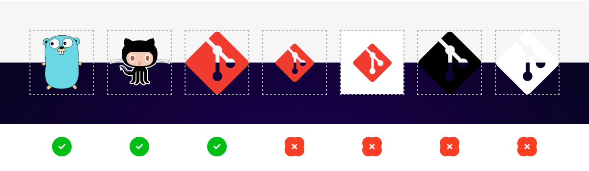

## Emoji Reference

### Buildkite

Emoji | Aliases
----- | -------
 | `:steam:`
 | `:allure:`
 | `:astro:`
 | `:flatcar:`
 | `:vmware:`
 | `:vespa:`
 | `:graphite:`
 | `:expo:`
 | `:envoy:`
 | `:polar-bear-police:`
 | `:qt:`
 | `:platformio:`
 | `:openwrt:`
 | `:pypi:, :pip:`
 | `:cdk8s:`
 | `:detekt:`
 | `:kaniko:`
 | `:grow-inc:`
 | `:grow-inc-dlta:`
 | `:dataflow:`
 | `:rokt:`
 | `:dvc:`
 | `:cml:`
 | `:checkly:`
 | `:wiz:`
 | `:lacework:`
 | `:ruff:`
 | `:powershell:`, `:pwsh:`
 | `:equinix-metal:`, `:eqix-metal:`
 | `:equinix:`, `:eqix:`
 | `:gandalf:`, `:you_shall_not_pass:`
 | `:podium:`, `:pdm:`
 | `:bonezone:`, `:skeleton-dance:`, `:mr-bones:`
 | `:modallabs:`, `:modal:`
 | `:vercel:`, `::`
 | `:namespace:`, `:ns:`
 | `:osv:`
 | `:osv-scanner:`
 | `:gadget:`
 | `:anyscale:`
 | `:ray:`
 | `:ray-serve:`
 | `:precommit:`
 | `:charger:`
 | `:truffleruby:`
 | `:draft-pull-request:`, `:draft-pr:`
 | `:open-pull-request:`, `:open-pr:`
 | `:merged-pull-request:`, `:merged-pr:`
 | `:closed-pull-request:`, `:closed-pr:`
 | `:boundary:`, `:hashicorp-boundary:`
 | `:waypoint:`, `:hashicorp-waypoint:`
 | `:pony:`
 | `:shop:`
 | `:fresh:`
 | `:c:`
 | `:garden-io:`
 | `:usertesting:`
 | `:express:`, `:expressjs:`
 | `:applied_intuition:`, `:appliedintuition:`, `:applied-intuition:`
 | `:alertsite:`, `:smartbear-alertsite:`
 | `:aqtimepro:`, `:smartbear-aqtimepro:`
 | `:bitbar:`, `:smartbear-bitbar:`
 | `:bugsnag:`, `:smartbear-bugsnag:`
 | `:capture:`, `:smartbear-capture:`
 | `:collaborator:`, `:smartbear-collaborator:`
 | `:cucumber-studio:`, `:smartbear-cucumber:`
 | `:cucumber-open:`, `:cucumber:`, `:cucumber-io:`, `:cucumberopen:`, `:smartbear-cucumberopen:`
 | `:loadninja:`, `:smartbear-loadninja:`
 | `:pact:`, `:smartbear-pact:`
 | `:pactflow:`, `:smartbear-pactflow:`
 | `:soapui:`, `:smartbear-soapui:`
 | `:swagger:`, `:smartbear-swagger:`
 | `:swaggerhub:`, `:smartbear-swaggerhub:`
 | `:testcomplete:`, `:smartbear-testcomplete:`
 | `:testengine:`, `:smartbear-testengine:`
 | `:testexecute:`, `:smartbear-testexecute:`
 | `:testleft:`, `:smartbear-testleft:`
 | `:visualtest:`, `:smartbear-visualtest:`
 | `:zephyr:`, `:smartbear-zephyr:`
 | `:zephyrscale:`, `:smartbear-zephyrscale:`
 | `:zephyrsquad:`, `:smartbear-zephyrsquad:`
 | `:esbuild:`
 | `:kart:`
 | `:locust:`
 | `:gitlab:`
 | `:stack_overflow:`, `:stackoverflow:`, `:stack-overflow:`
 | `:imperva:`
 | `:deno:`
 | `:opensearch:`
 | `:linear:`
 | `:opentelemetry:`, `:otel:`
 | `:strongdm:`, `:sdm:`
 | `:uefi:`
 | `:docusaurus:`
 | `:plausible:`
 | `:applitools:`
 | `:pyright:`
 | `:databricks:`
 | `:spacelift:`
 | `:spacelift-dark:`
 | `:preact:`
 | `:tapioca:`
 | `:alma:`
 | `:rocky:`
 | `:swc:`
 | `:horovod:`
 | `:changesets:`
 | `:gerrit:`
 | `:elastic-enterprise-search:`
 | `:elastic-apm:`
 | `:logstash:`
 | `:beats:`
 | `:grype:`
 | `:ngrok:`
 | `:vitest:`
 | `:vite:`
 | `:apache_flink:`, `:flink:`
 | `:salus:`
 | `:aspect-build:`, `:aspect:`
 | `:aspect-build-dark:`, `:aspect-dark:`
 | `:aspect-dev:`
 | `:aspect-dev-dark:`
 | `:appcenter:`
 | `:triple-green-shell:`
 | `:organicresponse:`, `:or:`
 | `:ladle:`
 | `:jetpack:`
 | `:test-analytics:`
 | `:qemu:`
 | `:planetscale:`
 | `:buildah:`
 | `:sst:`
 | `:nx:`
 | `:buildbuddy:`
 | `:api-extractor:`
 | `:atlassian-opsgenie:`, `:opsgenie:`
 | `:pants:`, `:pantsbuild:`
 | `:backstage:`
 | `:terragrunt:`
 | `:hydrogen:`, `:h2:`
 | `:hermit:`, `:hermitise:`
 | `:proto:`
 | `:octopus-deploy:`
 | `:mpi:`
 | `:snyk:`
 | `:nextjs:`
 | `:pnpm:`
 | `:solhint:`
 | `:buf:`
 | `:pre-commit:`
 | `:gitguardian:`
 | `:vscode:`
 | `:chronosphere:`
 | `:arch:`
 | `:cmake:`
 | `:engflow:`
 | `:gitpod:`
 | `:playwright:`
 | `:fastly:`
 | `:google-chat:`
 | `:faros:`
 | `:flowerwork:`
 | `:k6:`
 | `:browserstack:`
 | `:tableau:`
 | `:visual-regression-tracker:`
 | `:selenium-gauge:`
 | `:postman:`, `:newman:`
 | `:scaleway:`, `:scw:`
 | `:mssql:`
 | `:ms-teams:`
 | `:switch:`
 | `:trivy:`
 | `:komodor:`
 | `:tilt-dev:`
 | `:elastic:`
 | `:kibana:`
 | `:elastic-stack:`
 | `:elastic-cloud:`
 | `:elastic-cloud-enterprise:`
 | `:elastic-cloud-kubernetes:`
 | `:xbox:`
 | `:playstation:`
 | `:shopify:`
 | `:database:`
 | `:dagster:`
 | `:cloudflare:`
 | `:copybara:`
 | `:spinnaker:`
 | `:mongodb:`
 | `:repolinter:`
 | `:liquibase:`
 | `:pinterest-teletraan:`, `:teletraan:`
 | `:github:`
 | `:clearbit:`
 | `:auditjs:`
 | `:nancy:`
 | `:golangci-lint:`
 | `:semgrep:`
 | `:home-assistant:`, `:hass:`
 | `:nexus-iq:`
 | `:vault:`, `:hashicorp-vault:`
 | `:assurance:`
 | `:sonarcloud:`
 | `:crystal:`
 | `:zapier:`
 | `:julia:`
 | `:isort:`
 | `:alpine:`
 | `:azure:`
 | `:gitsby:`
 | `:postmark:`
 | `:twilio:`
 | `:boomi:`
 | `:wordpress:`
 | `:pfsense:`
 | `:traefik:`
 | `:meteor:`
 | `:moodle:`
 | `:neo4j:`
 | `:rstats:`
 | `:google-apps-script:`
 | `:firebase:`
 | `:one-does-not-simply:`
 | `:thisisfine:`
 | `:perfection:`
 | `:sweating:`
 | `:serverspec:`
 | `:travisci:`
 | `:podman:`
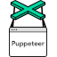 | `:puppeteer:`
 | `:auth0:`
 | `:lua:`
 | `:walrusai:`
 | `:openpolicyagent:`
 | `:snowflake-db:`, `:snowsql:`
 | `:dbt:`
 | `:shrek:`
 | `:airbnb_stork:`
 | `:circleci:`
 | `:csharp:`
 | `:dotnet:`
 | `:fsharp:`
 | `:nomad:`, `:hashicorp-nomad:`
 | `:vagrant:`, `:hashicorp-vagrant:`
 | `:karate:`, `:karate-api:`
 | `:codeception:`, `:codecept:`
 | `:phpstan:`
 | `:django:`
 | `:vue:`
 | `:jupyter:`
 | `:algolia:`
 | `:subversion:`, `:svn:`
 | `:batfish:`
 | `:atlassian-confluence:`, `:confluence:`
 | `:atlassian-bitbucket:`, `:bitbucket:`
 | `:atlassian-jira:`, `:jira:`
 | `:atlassian:`
 | `:gatling:`
 | `:phpunit:`
 | `:behat:`
 | `:consul:`, `:hashicorp-consul:`
 | `:chromatic:`
 | `:bk-status-passed:`
 | `:bk-status-failed:`
 | `:bk-status-failing:`
 | `:bk-status-pending:`
 | `:bk-status-running:`
 | `:dartlang:`
 | `:flutter:`
 | `:jfrog-conan:`, `:conan:`, `:conanio:`
 | `:jfrog:`
 | `:jfrog-artifactory:`, `:artifactory:`
 | `:jfrog-xray:`
 | `:cpp:`, `:cplusplus:`, `:c++:`
 | `:jenkins:`
 | `:tensorflow:`
 | `:zookeeper:`
 | `:rollup:`
 | `:argo:`, `:argocd:`, `:argo-cd:`
 | `:bandit:`
 | `:mypy:`
 | `:messagemedia:`
 | `:ios:`
 | `:aerospike:`
 | `:plaidml:`
 | `:tslint:`
 | `:jsonnet:`
 | `:raspberry-pi:`
 | `:sqlite:`
 | `:sorbet:`, `:srb:`
 | `:sonarqube:`
 | `:wasm:`, `:webassembly:`
 | `:hbase:`
 | `:elasticsearch:`
 | `:clippy:`
 | `:grafana:`
 | `:asciidoctor:`
 | `:python-black:`
 | `:test-kitchen:`, `:kitchen-ci:`
 | `:gatsby:`
 | `:fluentd:`
 | `:cloudsmith:`
 | `:sidekiq:`
 | `:hadolint:`
 | `:purescript:`
 | `:haskell:`, `:hs:`
 | `:gradle:`
 | `:wayfair:`
 | `:xcode:`
 | `:xcode_simulator:`
 | `:pinterest:`
 | `:jinja:`
 | `:phabricator:`
 | `:pulumi:`
 | `:expeditor:`
 | `:airflow:`
 | `:nix:`, `:nixos:`
 | `:glitch:`
 | `:fly-io:`, `:superfly:`
 | `:lint-roller:`, `:lint-remover:`
 | `:salesforce:`, `:sfdx:`
 | `:esdoc:`
 | `:testobject:`
 | `:lighthouse:`
 | `:coverage:`
 | `:fsociety:`
 | `:rubysec:`
 | `:ember:`, `:tomster:`
 | `:angular:`
 | `:appium:`
 | `:redis:`
 | `:anka:`
 | `:m3db:`, `:m3:`
 | `:yaml:`
 | `:java:`
 | `:apache:`
 | `:pytest:`
 | `:hugo:`, `:gohugo:`
 | `:ie:`, `:internet_explorer:`
 | `:medical_symbol:`
 | `:gnu:`
 | `:habicat:`
 | `:chef:`, `:opscode:`, `:chef-logo:`
 | `:inspec:`, `:chef-inspec:`
 | `:hyper:`
 | `:sentry:`
 | `:prettier:`
 | `:retirejs:`
 | `:nodesecurity:`, `:nsp:`
 | `:quick:`
 | `:fabric:`
 | `:cocoapods:`
 | `:safari:`
 | `:edge:`, `:microsoftedge:`
 | `:clojure:`, `:clj:`
 | `:clojurescript:`, `:cljs:`
 | `:suitest:`
 | `:codeclimate:`
 | `:convox:`
 | `:helm:`
 | `:markdown:`, `:md:`
 | `:relay:`
 | `:watchman:`
 | `:piedpiper:`
 | `:cloudfront:`
 | `:python:`
 | `:hiptest:`
 | `:cloudfoundry:`
 | `:netbsd:`
 | `:openbsd:`
 | `:dragonflybsd:`
 | `:rancher:`
 | `:nightmare:`
 | `:gulp:`
 | `:stryker:`, `:stryker-js:`
 | `:bash:`
 | `:jekyll:`
 | `:bazel:`
 | `:junit:`
 | `:maven:`, `:mvn:`
 | `:closure-compiler:`, `:google-closure-compiler:`
 | `:storybook:`, `:react-storybook:`
 | `:chromium:`
 | `:selenium:`
 | `:saucelabs:`
 | `:cargo:`, `:crates:`
 | `:rust:`, `:rustlang:`
 | `:kubernetes:`, `:k8s:`
 | `:spark:`
 | `:kafka:`
 | `:hadoop:`
 | `:scala:`
 | `:sbt:`
 | `:ecr:`
 | `:percy:`
 | `:civicrm:`, `:civi:`
 | `:html-proofer:`, `:html:`
 | `:haml:`, `:haml-lang:`
 | `:akamai:`
 | `:pagerduty:`
 | `:yarn:`, `:yarnpkg:`
 | `:looker:`
 | `:jest:`
 | `:fork:`
 | `:stylelint:`
 | `:chrome:`
 | `:flowtype:`
 | `:grunt:`
 | `:protractor:`
 | `:electron:`
 | `:testflight:`
 | `:rollbar:`
 | `:lendinghome:`
 | `:lendinghome_ops:`
 | `:jshint:`
 | `:scsslint:`
 | `:sasslang:`
 | `:sadpanda:`
 | `:partyparrot:`
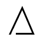 | `:apex:`
 | `:serverless:`
 | `:hockeyapp:`
 | `:firefox:`
 | `:mina:`
 | `:webhook:`
 | `:slack:`
 | `:hipchat:`
 | `:flowdock:`
 | `:campfire:`
 | `:sumologic:`
 | `:swift:`
 | `:graphql:`
 | `:cogops:`
 | `:aws:`, `:amazon-aws:`
 | `:mocha:`
 | `:rails:`
 | `:phoenix-elixir:`
 | `:brunch:`
 | `:android:`
 | `:jasmine:`
 | `:react:`
 | `:terraform:`, `:hashicorp-terraform:`
 | `:javascript:`, `:js:`
 | `:typescript:`
 | `:git:`
 | `:packer:`, `:hashicorp-packer:`
 | `:babel:`
 | `:pipeline:`, `:pipeline_upload:`
 | `:allthethings:`
 | `:ansible:`
 | `:appengine:`, `:gappengine:`
 | `:basecamp:`
 | `:basecampy:`
 | `:bower:`
 | `:bowtie:`
 | `:brakeman:`
 | `:buildkite:`
 | `:bundler:`
 | `:calibre:`
 | `:capistrano:`
 | `:centos:`
 | `:codecov:`
 | `:compute:`, `:gcompute:`
 | `:datadog:`
 | `:datocms:`, `:dato:`
 | `:debian:`
 | `:detox:`
 | `:docker:`
 | `:eslint:`
 | `:fastlane:`
 | `:fedora:`
 | `:feelsgood:`
 | `:finder:`
 | `:finnadie:`
 | `:flynn:`
 | `:freebsd:`
 | `:fu:`
 | `:goberserk:`
 | `:godmode:`
 | `:golang:`, `:go:`
 | `:googlecloud:`, `:gcloud:`, `:gcp:`
 | `:green_button:`
 | `:heroku:`
 | `:hurtrealbad:`
 | `:json:`
 | `:karma:`
 | `:knapsack:`
 | `:linux:`
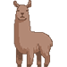 | `:llama:`, `:lox-llama:`
 | `:mac:`, `:darwin:`, `:macos:`
 | `:metal:`
 | `:mysql:`
 | `:neckbeard:`
 | `:newrelic:`
 | `:nginx:`
 | `:node:`, `:node_js:`, `:nodejs:`
 | `:npm:`
 | `:octocat:`
 | `:oracle_linux:`
 | `:packagecloud:`, `:package_cloud:`
 | `:php:`
 | `:postgres:`
 | `:rage1:`
 | `:rage2:`
 | `:rage3:`
 | `:rage4:`
 | `:red_button:`
 | `:redhat:`, `:rhel:`, `:enterprise_linux:`
 | `:route53:`
 | `:rspec:`
 | `:rubocop:`
 | `:ruby:`
 | `:elixir:`
 | `:credo:`
 | `:erlang:`
 | `:hex:`
 | `:rubygems:`
 | `:scientific_linux:`
 | `:shipit:`
 | `:shippit:`
 | `:suspect:`
 | `:terminal:`, `:console:`
 | `:trollface:`, `:troll:`
 | `:ubuntu:`
 | `:parcel:`, `:parcel-bundler:`
 | `:webpack:`
 | `:windows:`
 | `:quay:`, `:quay.io:`
 | `:wraith:`
 | `:elm:`, `:elmlang:`
 | `:exploding_death_star:`
 | `:composer:`
 | `:singularity:`
 | `:kotlin:`
 | `:buck:`
 | `:cypress:`, `:cypressio:`
 | `:virtru:`
 | `:happo:`
 | `:rea:`
 | `:carthage:`
 | `:amazon-apigateway:`
 | `:amazon-athena:`
 | `:amazon-aurora:`
 | `:amazon-chime:`
 | `:amazon-clouddirectory:`
 | `:amazon-cloudsearch:`
 | `:amazon-cloudwatch:`, `:cloudwatch:`
 | `:amazon-cognito:`
 | `:amazon-connect:`
 | `:amazon-dynamodb:`, `:dynamodb:`
 | `:amazon-dynamodbaccelerator:`
 | `:amazon-ec2:`, `:ec2:`
 | `:amazon-ec2systemsmanager:`
 | `:amazon-ecs:`, `:ecs:`
 | `:amazon-efs:`
 | `:amazon-eks:`, `:eks:`
 | `:amazon-elasticcache:`
 | `:amazon-elastictranscoder:`
 | `:amazon-emr:`, `:emr:`
 | `:amazon-opensearch:`
 | `:amazon-eventbridge:`, `:eventbridge:`
 | `:amazon-gamelift:`
 | `:amazon-glacier:`
 | `:amazon-inspector:`
 | `:amazon-kinesis:`, `:kinesis:`
 | `:amazon-lex:`
 | `:amazon-lightsail:`
 | `:amazon-machinelearning:`
 | `:amazon-macie:`
 | `:amazon-mechanicalturk:`
 | `:amazon-mobileanalytics:`
 | `:amazon-pinpoint:`
 | `:amazon-polly:`
 | `:amazon-quicksight:`
 | `:amazon-rds:`
 | `:amazon-redshift:`
 | `:amazon-rekognition:`
 | `:amazon-s3:`, `:s3:`
 | `:amazon-ses:`
 | `:amazon-sns:`
 | `:amazon-sqs:`
 | `:amazon-swf:`
 | `:amazon-vpc:`
 | `:aws-applicationdiscoveryservice:`
 | `:aws-artifact:`
 | `:aws-batch:`
 | `:aws-certificatemanager:`
 | `:aws-cli:`
 | `:aws-cloudformation:`, `:cloudformation:`
 | `:aws-cloudhsm:`
 | `:aws-cloudtrail:`
 | `:aws-codebuild:`
 | `:aws-codecommit:`
 | `:aws-codedeploy:`, `:codedeploy:`
 | `:aws-codepipeline:`, `:codepipeline:`
 | `:aws-codestar:`
 | `:aws-config:`
 | `:aws-datapipeline:`
 | `:aws-devicefarm:`
 | `:aws-directoryservice:`
 | `:aws-dms:`
 | `:aws-elasticbeanstalk:`, `:elasticbeanstalk:`
 | `:aws-glue:`
 | `:aws-iam:`
 | `:aws-iot:`
 | `:aws-kms:`
 | `:aws-lambda:`, `:lambda:`
 | `:aws-logo:`
 | `:aws-managedservices:`
 | `:aws-opsworks:`
 | `:aws-organizations:`
 | `:aws-sagemaker:`
 | `:aws-servicecatalog:`
 | `:aws-shield:`
 | `:aws-sms:`
 | `:aws-snowball:`
 | `:aws-stepfunctions:`
 | `:aws-storagegateway:`
 | `:aws-timestream:`
 | `:aws-trustedadvisor:`
 | `:aws-waf:`
 | `:aws-x-ray:`
 | `:elasticloadbalancing:`
 | `:splunk:`
 | `:batman:`
 | `:prometheus:`
 | `:hubspot:`
 | `:tauri:`
 | `:kong:`
 | `:openapi:`
 | `:buildpacks:`
 | `:shopify-liquid:`
 | `:intuit-auto:`, `:auto:`
 | `:canva:`
 | `:renovate:`
 | `:influxdata:`
 | `:keymaster:`
 | `:turborepo:`
 | `:gravatar:`

### Smileys & Emotion

Emoji | Aliases
----- | -------
 | `:heart:`
 | `:mending_heart:`
 | `:heart_on_fire:`
 | `:heavy_heart_exclamation_mark_ornament:`
 | `:relaxed:`
 | `:white_frowning_face:`
 | `:skull_and_crossbones:`
 | `:shaking_face:`
 | `:dotted_line_face:`
 | `:face_with_diagonal_mouth:`
 | `:face_with_peeking_eye:`
 | `:face_with_open_eyes_and_hand_over_mouth:`
 | `:saluting_face:`
 | `:melting_face:`
 | `:pink_heart:`
 | `:grey_heart:`
 | `:light_blue_heart:`
 | `:orange_heart:`
 | `:face_with_monocle:`
 | `:pleading_face:`
 | `:face_holding_back_tears:`
 | `:disguised_face:`
 | `:cold_face:`
 | `:hot_face:`
 | `:woozy_face:`
 | `:partying_face:`
 | `:smiling_face_with_tear:`
 | `:yawning_face:`
 | `:smiling_face_with_3_hearts:`
 | `:exploding_head:`, `:shocked_face_with_exploding_head:`
 | `:face_vomiting:`, `:face_with_open_mouth_vomiting:`
 | `:face_with_hand_over_mouth:`, `:smiling_face_with_smiling_eyes_and_hand_covering_mouth:`
 | `:face_with_symbols_on_mouth:`, `:serious_face_with_symbols_covering_mouth:`
 | `:shushing_face:`, `:face_with_finger_covering_closed_lips:`
 | `:zany_face:`, `:grinning_face_with_one_large_and_one_small_eye:`
 | `:star-struck:`, `:grinning_face_with_star_eyes:`
 | `:face_with_raised_eyebrow:`, `:face_with_one_eyebrow_raised:`
 | `:sneezing_face:`
 | `:lying_face:`
 | `:drooling_face:`
 | `:rolling_on_the_floor_laughing:`
 | `:nauseated_face:`
 | `:clown_face:`
 | `:face_with_cowboy_hat:`
 | `:hugging_face:`
 | `:robot_face:`
 | `:face_with_head_bandage:`
 | `:thinking_face:`
 | `:nerd_face:`
 | `:face_with_thermometer:`
 | `:money_mouth_face:`
 | `:zipper_mouth_face:`
 | `:brown_heart:`
 | `:white_heart:`
 | `:speak_no_evil:`
 | `:hear_no_evil:`
 | `:see_no_evil:`
 | `:face_with_rolling_eyes:`
 | `:upside_down_face:`
 | `:slightly_smiling_face:`
 | `:head_shaking_vertically:`
 | `:head_shaking_horizontally:`
 | `:slightly_frowning_face:`
 | `:scream_cat:`
 | `:crying_cat_face:`
 | `:pouting_cat:`
 | `:kissing_cat:`
 | `:smirk_cat:`
 | `:heart_eyes_cat:`
 | `:smiley_cat:`
 | `:joy_cat:`
 | `:smile_cat:`
 | `:mask:`
 | `:no_mouth:`
 | `:face_in_clouds:`
 | `:dizzy_face:`
 | `:face_with_spiral_eyes:`
 | `:sleeping:`
 | `:flushed:`
 | `:astonished:`
 | `:scream:`
 | `:cold_sweat:`
 | `:hushed:`
 | `:open_mouth:`
 | `:face_exhaling:`
 | `:sob:`
 | `:grimacing:`
 | `:tired_face:`
 | `:sleepy:`
 | `:weary:`
 | `:fearful:`
 | `:anguished:`
 | `:frowning:`
 | `:disappointed_relieved:`
 | `:triumph:`
 | `:persevere:`
 | `:cry:`
 | `:rage:`
 | `:angry:`
 | `:worried:`
 | `:disappointed:`
 | `:stuck_out_tongue_closed_eyes:`
 | `:stuck_out_tongue_winking_eye:`
 | `:stuck_out_tongue:`
 | `:kissing_closed_eyes:`
 | `:kissing_smiling_eyes:`
 | `:kissing_heart:`
 | `:kissing:`
 | `:confounded:`
 | `:confused:`
 | `:pensive:`
 | `:sweat:`
 | `:unamused:`
 | `:expressionless:`
 | `:neutral_face:`
 | `:smirk:`
 | `:sunglasses:`
 | `:heart_eyes:`
 | `:relieved:`
 | `:yum:`
 | `:blush:`
 | `:wink:`
 | `:smiling_imp:`
 | `:innocent:`
 | `:laughing:`, `:satisfied:`
 | `:sweat_smile:`
 | `:smile:`
 | `:smiley:`
 | `:joy:`
 | `:grin:`
 | `:grinning:`
 | `:right_anger_bubble:`
 | `:left_speech_bubble:`
 | `:black_heart:`
 | `:hole:`
 | `:100:`
 | `:thought_balloon:`
 | `:speech_balloon:`
 | `:dizzy:`
 | `:hankey:`, `:poop:`, `:shit:`
 | `:dash:`
 | `:sweat_drops:`
 | `:boom:`, `:collision:`
 | `:zzz:`
 | `:anger:`
 | `:heart_decoration:`
 | `:revolving_hearts:`
 | `:gift_heart:`
 | `:purple_heart:`
 | `:yellow_heart:`
 | `:green_heart:`
 | `:blue_heart:`
 | `:cupid:`
 | `:heartpulse:`
 | `:sparkling_heart:`
 | `:two_hearts:`
 | `:broken_heart:`
 | `:heartbeat:`
 | `:love_letter:`
 | `:kiss:`
 | `:skull:`
 | `:imp:`
 | `:space_invader:`
 | `:alien:`
 | `:ghost:`
 | `:japanese_goblin:`
 | `:japanese_ogre:`
 | `:eye-in-speech-bubble:`

### People & Body

Emoji | Aliases
----- | -------
 | `:writing_hand:`
 | `:writing_hand::skin-tone-2:`
 | `:writing_hand::skin-tone-3:`
 | `:writing_hand::skin-tone-4:`
 | `:writing_hand::skin-tone-5:`
 | `:writing_hand::skin-tone-6:`
 | `:v:`
 | `:v::skin-tone-2:`
 | `:v::skin-tone-3:`
 | `:v::skin-tone-4:`
 | `:v::skin-tone-5:`
 | `:v::skin-tone-6:`
 | `:hand:`, `:raised_hand:`
 | `:hand::skin-tone-2:`
 | `:hand::skin-tone-3:`
 | `:hand::skin-tone-4:`
 | `:hand::skin-tone-5:`
 | `:hand::skin-tone-6:`
 | `:fist:`
 | `:fist::skin-tone-2:`
 | `:fist::skin-tone-3:`
 | `:fist::skin-tone-4:`
 | `:fist::skin-tone-5:`
 | `:fist::skin-tone-6:`
 | `:person_with_ball:`
 | `:person_with_ball::skin-tone-2:`
 | `:person_with_ball::skin-tone-3:`
 | `:person_with_ball::skin-tone-4:`
 | `:person_with_ball::skin-tone-5:`
 | `:person_with_ball::skin-tone-6:`
 | `:man-bouncing-ball:`
 | `:man-bouncing-ball::skin-tone-2:`
 | `:man-bouncing-ball::skin-tone-3:`
 | `:man-bouncing-ball::skin-tone-4:`
 | `:man-bouncing-ball::skin-tone-5:`
 | `:man-bouncing-ball::skin-tone-6:`
 | `:woman-bouncing-ball:`
 | `:woman-bouncing-ball::skin-tone-2:`
 | `:woman-bouncing-ball::skin-tone-3:`
 | `:woman-bouncing-ball::skin-tone-4:`
 | `:woman-bouncing-ball::skin-tone-5:`
 | `:woman-bouncing-ball::skin-tone-6:`
 | `:skier:`
 | `:point_up:`
 | `:point_up::skin-tone-2:`
 | `:point_up::skin-tone-3:`
 | `:point_up::skin-tone-4:`
 | `:point_up::skin-tone-5:`
 | `:point_up::skin-tone-6:`
 | `:rightwards_pushing_hand:`
 | `:rightwards_pushing_hand::skin-tone-2:`
 | `:rightwards_pushing_hand::skin-tone-3:`
 | `:rightwards_pushing_hand::skin-tone-4:`
 | `:rightwards_pushing_hand::skin-tone-5:`
 | `:rightwards_pushing_hand::skin-tone-6:`
 | `:leftwards_pushing_hand:`
 | `:leftwards_pushing_hand::skin-tone-2:`
 | `:leftwards_pushing_hand::skin-tone-3:`
 | `:leftwards_pushing_hand::skin-tone-4:`
 | `:leftwards_pushing_hand::skin-tone-5:`
 | `:leftwards_pushing_hand::skin-tone-6:`
 | `:heart_hands:`
 | `:heart_hands::skin-tone-2:`
 | `:heart_hands::skin-tone-3:`
 | `:heart_hands::skin-tone-4:`
 | `:heart_hands::skin-tone-5:`
 | `:heart_hands::skin-tone-6:`
 | `:index_pointing_at_the_viewer:`
 | `:index_pointing_at_the_viewer::skin-tone-2:`
 | `:index_pointing_at_the_viewer::skin-tone-3:`
 | `:index_pointing_at_the_viewer::skin-tone-4:`
 | `:index_pointing_at_the_viewer::skin-tone-5:`
 | `:index_pointing_at_the_viewer::skin-tone-6:`
 | `:palm_up_hand:`
 | `:palm_up_hand::skin-tone-2:`
 | `:palm_up_hand::skin-tone-3:`
 | `:palm_up_hand::skin-tone-4:`
 | `:palm_up_hand::skin-tone-5:`
 | `:palm_up_hand::skin-tone-6:`
 | `:palm_down_hand:`
 | `:palm_down_hand::skin-tone-2:`
 | `:palm_down_hand::skin-tone-3:`
 | `:palm_down_hand::skin-tone-4:`
 | `:palm_down_hand::skin-tone-5:`
 | `:palm_down_hand::skin-tone-6:`
 | `:leftwards_hand:`
 | `:leftwards_hand::skin-tone-2:`
 | `:leftwards_hand::skin-tone-3:`
 | `:leftwards_hand::skin-tone-4:`
 | `:leftwards_hand::skin-tone-5:`
 | `:leftwards_hand::skin-tone-6:`
 | `:rightwards_hand:`
 | `:rightwards_hand::skin-tone-2:`
 | `:rightwards_hand::skin-tone-3:`
 | `:rightwards_hand::skin-tone-4:`
 | `:rightwards_hand::skin-tone-5:`
 | `:rightwards_hand::skin-tone-6:`
 | `:hand_with_index_finger_and_thumb_crossed:`
 | `:hand_with_index_finger_and_thumb_crossed::skin-tone-2:`
 | `:hand_with_index_finger_and_thumb_crossed::skin-tone-3:`
 | `:hand_with_index_finger_and_thumb_crossed::skin-tone-4:`
 | `:hand_with_index_finger_and_thumb_crossed::skin-tone-5:`
 | `:hand_with_index_finger_and_thumb_crossed::skin-tone-6:`
 | `:biting_lip:`
 | `:person_with_crown:`
 | `:person_with_crown::skin-tone-2:`
 | `:person_with_crown::skin-tone-3:`
 | `:person_with_crown::skin-tone-4:`
 | `:person_with_crown::skin-tone-5:`
 | `:person_with_crown::skin-tone-6:`
 | `:pregnant_person:`
 | `:pregnant_person::skin-tone-2:`
 | `:pregnant_person::skin-tone-3:`
 | `:pregnant_person::skin-tone-4:`
 | `:pregnant_person::skin-tone-5:`
 | `:pregnant_person::skin-tone-6:`
 | `:pregnant_man:`
 | `:pregnant_man::skin-tone-2:`
 | `:pregnant_man::skin-tone-3:`
 | `:pregnant_man::skin-tone-4:`
 | `:pregnant_man::skin-tone-5:`
 | `:pregnant_man::skin-tone-6:`
 | `:people_hugging:`
 | `:lungs:`
 | `:anatomical_heart:`
 | `:brain:`
 | `:zombie:`
 | `:male_zombie:`
 | `:female_zombie:`
 | `:genie:`
 | `:male_genie:`
 | `:female_genie:`
 | `:elf:`
 | `:elf::skin-tone-2:`
 | `:elf::skin-tone-3:`
 | `:elf::skin-tone-4:`
 | `:elf::skin-tone-5:`
 | `:elf::skin-tone-6:`
 | `:male_elf:`
 | `:male_elf::skin-tone-2:`
 | `:male_elf::skin-tone-3:`
 | `:male_elf::skin-tone-4:`
 | `:male_elf::skin-tone-5:`
 | `:male_elf::skin-tone-6:`
 | `:female_elf:`
 | `:female_elf::skin-tone-2:`
 | `:female_elf::skin-tone-3:`
 | `:female_elf::skin-tone-4:`
 | `:female_elf::skin-tone-5:`
 | `:female_elf::skin-tone-6:`
 | `:merperson:`
 | `:merperson::skin-tone-2:`
 | `:merperson::skin-tone-3:`
 | `:merperson::skin-tone-4:`
 | `:merperson::skin-tone-5:`
 | `:merperson::skin-tone-6:`
 | `:merman:`
 | `:merman::skin-tone-2:`
 | `:merman::skin-tone-3:`
 | `:merman::skin-tone-4:`
 | `:merman::skin-tone-5:`
 | `:merman::skin-tone-6:`
 | `:mermaid:`
 | `:mermaid::skin-tone-2:`
 | `:mermaid::skin-tone-3:`
 | `:mermaid::skin-tone-4:`
 | `:mermaid::skin-tone-5:`
 | `:mermaid::skin-tone-6:`
 | `:vampire:`
 | `:vampire::skin-tone-2:`
 | `:vampire::skin-tone-3:`
 | `:vampire::skin-tone-4:`
 | `:vampire::skin-tone-5:`
 | `:vampire::skin-tone-6:`
 | `:male_vampire:`
 | `:male_vampire::skin-tone-2:`
 | `:male_vampire::skin-tone-3:`
 | `:male_vampire::skin-tone-4:`
 | `:male_vampire::skin-tone-5:`
 | `:male_vampire::skin-tone-6:`
 | `:female_vampire:`
 | `:female_vampire::skin-tone-2:`
 | `:female_vampire::skin-tone-3:`
 | `:female_vampire::skin-tone-4:`
 | `:female_vampire::skin-tone-5:`
 | `:female_vampire::skin-tone-6:`
 | `:fairy:`
 | `:fairy::skin-tone-2:`
 | `:fairy::skin-tone-3:`
 | `:fairy::skin-tone-4:`
 | `:fairy::skin-tone-5:`
 | `:fairy::skin-tone-6:`
 | `:male_fairy:`
 | `:male_fairy::skin-tone-2:`
 | `:male_fairy::skin-tone-3:`
 | `:male_fairy::skin-tone-4:`
 | `:male_fairy::skin-tone-5:`
 | `:male_fairy::skin-tone-6:`
 | `:female_fairy:`
 | `:female_fairy::skin-tone-2:`
 | `:female_fairy::skin-tone-3:`
 | `:female_fairy::skin-tone-4:`
 | `:female_fairy::skin-tone-5:`
 | `:female_fairy::skin-tone-6:`
 | `:mage:`
 | `:mage::skin-tone-2:`
 | `:mage::skin-tone-3:`
 | `:mage::skin-tone-4:`
 | `:mage::skin-tone-5:`
 | `:mage::skin-tone-6:`
 | `:male_mage:`
 | `:male_mage::skin-tone-2:`
 | `:male_mage::skin-tone-3:`
 | `:male_mage::skin-tone-4:`
 | `:male_mage::skin-tone-5:`
 | `:male_mage::skin-tone-6:`
 | `:female_mage:`
 | `:female_mage::skin-tone-2:`
 | `:female_mage::skin-tone-3:`
 | `:female_mage::skin-tone-4:`
 | `:female_mage::skin-tone-5:`
 | `:female_mage::skin-tone-6:`
 | `:person_in_lotus_position:`
 | `:person_in_lotus_position::skin-tone-2:`
 | `:person_in_lotus_position::skin-tone-3:`
 | `:person_in_lotus_position::skin-tone-4:`
 | `:person_in_lotus_position::skin-tone-5:`
 | `:person_in_lotus_position::skin-tone-6:`
 | `:man_in_lotus_position:`
 | `:man_in_lotus_position::skin-tone-2:`
 | `:man_in_lotus_position::skin-tone-3:`
 | `:man_in_lotus_position::skin-tone-4:`
 | `:man_in_lotus_position::skin-tone-5:`
 | `:man_in_lotus_position::skin-tone-6:`
 | `:woman_in_lotus_position:`
 | `:woman_in_lotus_position::skin-tone-2:`
 | `:woman_in_lotus_position::skin-tone-3:`
 | `:woman_in_lotus_position::skin-tone-4:`
 | `:woman_in_lotus_position::skin-tone-5:`
 | `:woman_in_lotus_position::skin-tone-6:`
 | `:person_climbing:`
 | `:person_climbing::skin-tone-2:`
 | `:person_climbing::skin-tone-3:`
 | `:person_climbing::skin-tone-4:`
 | `:person_climbing::skin-tone-5:`
 | `:person_climbing::skin-tone-6:`
 | `:man_climbing:`
 | `:man_climbing::skin-tone-2:`
 | `:man_climbing::skin-tone-3:`
 | `:man_climbing::skin-tone-4:`
 | `:man_climbing::skin-tone-5:`
 | `:man_climbing::skin-tone-6:`
 | `:woman_climbing:`
 | `:woman_climbing::skin-tone-2:`
 | `:woman_climbing::skin-tone-3:`
 | `:woman_climbing::skin-tone-4:`
 | `:woman_climbing::skin-tone-5:`
 | `:woman_climbing::skin-tone-6:`
 | `:person_in_steamy_room:`
 | `:person_in_steamy_room::skin-tone-2:`
 | `:person_in_steamy_room::skin-tone-3:`
 | `:person_in_steamy_room::skin-tone-4:`
 | `:person_in_steamy_room::skin-tone-5:`
 | `:person_in_steamy_room::skin-tone-6:`
 | `:man_in_steamy_room:`
 | `:man_in_steamy_room::skin-tone-2:`
 | `:man_in_steamy_room::skin-tone-3:`
 | `:man_in_steamy_room::skin-tone-4:`
 | `:man_in_steamy_room::skin-tone-5:`
 | `:man_in_steamy_room::skin-tone-6:`
 | `:woman_in_steamy_room:`
 | `:woman_in_steamy_room::skin-tone-2:`
 | `:woman_in_steamy_room::skin-tone-3:`
 | `:woman_in_steamy_room::skin-tone-4:`
 | `:woman_in_steamy_room::skin-tone-5:`
 | `:woman_in_steamy_room::skin-tone-6:`
 | `:person_with_headscarf:`
 | `:person_with_headscarf::skin-tone-2:`
 | `:person_with_headscarf::skin-tone-3:`
 | `:person_with_headscarf::skin-tone-4:`
 | `:person_with_headscarf::skin-tone-5:`
 | `:person_with_headscarf::skin-tone-6:`
 | `:bearded_person:`
 | `:bearded_person::skin-tone-2:`
 | `:bearded_person::skin-tone-3:`
 | `:bearded_person::skin-tone-4:`
 | `:bearded_person::skin-tone-5:`
 | `:bearded_person::skin-tone-6:`
 | `:man_with_beard:`
 | `:man_with_beard::skin-tone-2:`
 | `:man_with_beard::skin-tone-3:`
 | `:man_with_beard::skin-tone-4:`
 | `:man_with_beard::skin-tone-5:`
 | `:man_with_beard::skin-tone-6:`
 | `:woman_with_beard:`
 | `:woman_with_beard::skin-tone-2:`
 | `:woman_with_beard::skin-tone-3:`
 | `:woman_with_beard::skin-tone-4:`
 | `:woman_with_beard::skin-tone-5:`
 | `:woman_with_beard::skin-tone-6:`
 | `:older_adult:`
 | `:older_adult::skin-tone-2:`
 | `:older_adult::skin-tone-3:`
 | `:older_adult::skin-tone-4:`
 | `:older_adult::skin-tone-5:`
 | `:older_adult::skin-tone-6:`
 | `:child:`
 | `:child::skin-tone-2:`
 | `:child::skin-tone-3:`
 | `:child::skin-tone-4:`
 | `:child::skin-tone-5:`
 | `:child::skin-tone-6:`
 | `:adult:`
 | `:adult::skin-tone-2:`
 | `:adult::skin-tone-3:`
 | `:adult::skin-tone-4:`
 | `:adult::skin-tone-5:`
 | `:adult::skin-tone-6:`
 | `:pilot:`
 | `:pilot::skin-tone-2:`
 | `:pilot::skin-tone-3:`
 | `:pilot::skin-tone-4:`
 | `:pilot::skin-tone-5:`
 | `:pilot::skin-tone-6:`
 | `:judge:`
 | `:judge::skin-tone-2:`
 | `:judge::skin-tone-3:`
 | `:judge::skin-tone-4:`
 | `:judge::skin-tone-5:`
 | `:judge::skin-tone-6:`
 | `:health_worker:`
 | `:health_worker::skin-tone-2:`
 | `:health_worker::skin-tone-3:`
 | `:health_worker::skin-tone-4:`
 | `:health_worker::skin-tone-5:`
 | `:health_worker::skin-tone-6:`
 | `:family_adult_child:`
 | `:family_adult_child_child:`
 | `:family_adult_adult_child_child:`
 | `:family_adult_adult_child:`
 | `:person_in_manual_wheelchair:`
 | `:person_in_manual_wheelchair::skin-tone-2:`
 | `:person_in_manual_wheelchair::skin-tone-3:`
 | `:person_in_manual_wheelchair::skin-tone-4:`
 | `:person_in_manual_wheelchair::skin-tone-5:`
 | `:person_in_manual_wheelchair::skin-tone-6:`
 | `:person_in_manual_wheelchair_facing_right:`
 | `:person_in_manual_wheelchair_facing_right::skin-tone-2:`
 | `:person_in_manual_wheelchair_facing_right::skin-tone-3:`
 | `:person_in_manual_wheelchair_facing_right::skin-tone-4:`
 | `:person_in_manual_wheelchair_facing_right::skin-tone-5:`
 | `:person_in_manual_wheelchair_facing_right::skin-tone-6:`
 | `:person_in_motorized_wheelchair:`
 | `:person_in_motorized_wheelchair::skin-tone-2:`
 | `:person_in_motorized_wheelchair::skin-tone-3:`
 | `:person_in_motorized_wheelchair::skin-tone-4:`
 | `:person_in_motorized_wheelchair::skin-tone-5:`
 | `:person_in_motorized_wheelchair::skin-tone-6:`
 | `:person_in_motorized_wheelchair_facing_right:`
 | `:person_in_motorized_wheelchair_facing_right::skin-tone-2:`
 | `:person_in_motorized_wheelchair_facing_right::skin-tone-3:`
 | `:person_in_motorized_wheelchair_facing_right::skin-tone-4:`
 | `:person_in_motorized_wheelchair_facing_right::skin-tone-5:`
 | `:person_in_motorized_wheelchair_facing_right::skin-tone-6:`
 | `:white_haired_person:`
 | `:white_haired_person::skin-tone-2:`
 | `:white_haired_person::skin-tone-3:`
 | `:white_haired_person::skin-tone-4:`
 | `:white_haired_person::skin-tone-5:`
 | `:white_haired_person::skin-tone-6:`
 | `:bald_person:`
 | `:bald_person::skin-tone-2:`
 | `:bald_person::skin-tone-3:`
 | `:bald_person::skin-tone-4:`
 | `:bald_person::skin-tone-5:`
 | `:bald_person::skin-tone-6:`
 | `:curly_haired_person:`
 | `:curly_haired_person::skin-tone-2:`
 | `:curly_haired_person::skin-tone-3:`
 | `:curly_haired_person::skin-tone-4:`
 | `:curly_haired_person::skin-tone-5:`
 | `:curly_haired_person::skin-tone-6:`
 | `:red_haired_person:`
 | `:red_haired_person::skin-tone-2:`
 | `:red_haired_person::skin-tone-3:`
 | `:red_haired_person::skin-tone-4:`
 | `:red_haired_person::skin-tone-5:`
 | `:red_haired_person::skin-tone-6:`
 | `:person_with_probing_cane:`
 | `:person_with_probing_cane::skin-tone-2:`
 | `:person_with_probing_cane::skin-tone-3:`
 | `:person_with_probing_cane::skin-tone-4:`
 | `:person_with_probing_cane::skin-tone-5:`
 | `:person_with_probing_cane::skin-tone-6:`
 | `:person_with_white_cane_facing_right:`
 | `:person_with_white_cane_facing_right::skin-tone-2:`
 | `:person_with_white_cane_facing_right::skin-tone-3:`
 | `:person_with_white_cane_facing_right::skin-tone-4:`
 | `:person_with_white_cane_facing_right::skin-tone-5:`
 | `:person_with_white_cane_facing_right::skin-tone-6:`
 | `:people_holding_hands:`
 | `:people_holding_hands::skin-tone-2:`
 | `:people_holding_hands::skin-tone-3:`
 | `:people_holding_hands::skin-tone-4:`
 | `:people_holding_hands::skin-tone-5:`
 | `:people_holding_hands::skin-tone-6:`
 | `:people_holding_hands::skin-tone-7:`
 | `:people_holding_hands::skin-tone-8:`
 | `:people_holding_hands::skin-tone-9:`
 | `:people_holding_hands::skin-tone-10:`
 | `:people_holding_hands::skin-tone-11:`
 | `:people_holding_hands::skin-tone-12:`
 | `:people_holding_hands::skin-tone-13:`
 | `:people_holding_hands::skin-tone-14:`
 | `:people_holding_hands::skin-tone-15:`
 | `:people_holding_hands::skin-tone-16:`
 | `:people_holding_hands::skin-tone-17:`
 | `:people_holding_hands::skin-tone-18:`
 | `:people_holding_hands::skin-tone-19:`
 | `:people_holding_hands::skin-tone-20:`
 | `:people_holding_hands::skin-tone-21:`
 | `:people_holding_hands::skin-tone-22:`
 | `:people_holding_hands::skin-tone-23:`
 | `:people_holding_hands::skin-tone-24:`
 | `:people_holding_hands::skin-tone-25:`
 | `:people_holding_hands::skin-tone-26:`
 | `:firefighter:`
 | `:firefighter::skin-tone-2:`
 | `:firefighter::skin-tone-3:`
 | `:firefighter::skin-tone-4:`
 | `:firefighter::skin-tone-5:`
 | `:firefighter::skin-tone-6:`
 | `:astronaut:`
 | `:astronaut::skin-tone-2:`
 | `:astronaut::skin-tone-3:`
 | `:astronaut::skin-tone-4:`
 | `:astronaut::skin-tone-5:`
 | `:astronaut::skin-tone-6:`
 | `:scientist:`
 | `:scientist::skin-tone-2:`
 | `:scientist::skin-tone-3:`
 | `:scientist::skin-tone-4:`
 | `:scientist::skin-tone-5:`
 | `:scientist::skin-tone-6:`
 | `:mechanic:`
 | `:mechanic::skin-tone-2:`
 | `:mechanic::skin-tone-3:`
 | `:mechanic::skin-tone-4:`
 | `:mechanic::skin-tone-5:`
 | `:mechanic::skin-tone-6:`
 | `:office_worker:`
 | `:office_worker::skin-tone-2:`
 | `:office_worker::skin-tone-3:`
 | `:office_worker::skin-tone-4:`
 | `:office_worker::skin-tone-5:`
 | `:office_worker::skin-tone-6:`
 | `:technologist:`
 | `:technologist::skin-tone-2:`
 | `:technologist::skin-tone-3:`
 | `:technologist::skin-tone-4:`
 | `:technologist::skin-tone-5:`
 | `:technologist::skin-tone-6:`
 | `:factory_worker:`
 | `:factory_worker::skin-tone-2:`
 | `:factory_worker::skin-tone-3:`
 | `:factory_worker::skin-tone-4:`
 | `:factory_worker::skin-tone-5:`
 | `:factory_worker::skin-tone-6:`
 | `:teacher:`
 | `:teacher::skin-tone-2:`
 | `:teacher::skin-tone-3:`
 | `:teacher::skin-tone-4:`
 | `:teacher::skin-tone-5:`
 | `:teacher::skin-tone-6:`
 | `:artist:`
 | `:artist::skin-tone-2:`
 | `:artist::skin-tone-3:`
 | `:artist::skin-tone-4:`
 | `:artist::skin-tone-5:`
 | `:artist::skin-tone-6:`
 | `:singer:`
 | `:singer::skin-tone-2:`
 | `:singer::skin-tone-3:`
 | `:singer::skin-tone-4:`
 | `:singer::skin-tone-5:`
 | `:singer::skin-tone-6:`
 | `:student:`
 | `:student::skin-tone-2:`
 | `:student::skin-tone-3:`
 | `:student::skin-tone-4:`
 | `:student::skin-tone-5:`
 | `:student::skin-tone-6:`
 | `:mx_claus:`
 | `:mx_claus::skin-tone-2:`
 | `:mx_claus::skin-tone-3:`
 | `:mx_claus::skin-tone-4:`
 | `:mx_claus::skin-tone-5:`
 | `:mx_claus::skin-tone-6:`
 | `:person_feeding_baby:`
 | `:person_feeding_baby::skin-tone-2:`
 | `:person_feeding_baby::skin-tone-3:`
 | `:person_feeding_baby::skin-tone-4:`
 | `:person_feeding_baby::skin-tone-5:`
 | `:person_feeding_baby::skin-tone-6:`
 | `:cook:`
 | `:cook::skin-tone-2:`
 | `:cook::skin-tone-3:`
 | `:cook::skin-tone-4:`
 | `:cook::skin-tone-5:`
 | `:cook::skin-tone-6:`
 | `:farmer:`
 | `:farmer::skin-tone-2:`
 | `:farmer::skin-tone-3:`
 | `:farmer::skin-tone-4:`
 | `:farmer::skin-tone-5:`
 | `:farmer::skin-tone-6:`
 | `:deaf_person:`
 | `:deaf_person::skin-tone-2:`
 | `:deaf_person::skin-tone-3:`
 | `:deaf_person::skin-tone-4:`
 | `:deaf_person::skin-tone-5:`
 | `:deaf_person::skin-tone-6:`
 | `:deaf_man:`
 | `:deaf_man::skin-tone-2:`
 | `:deaf_man::skin-tone-3:`
 | `:deaf_man::skin-tone-4:`
 | `:deaf_man::skin-tone-5:`
 | `:deaf_man::skin-tone-6:`
 | `:deaf_woman:`
 | `:deaf_woman::skin-tone-2:`
 | `:deaf_woman::skin-tone-3:`
 | `:deaf_woman::skin-tone-4:`
 | `:deaf_woman::skin-tone-5:`
 | `:deaf_woman::skin-tone-6:`
 | `:kneeling_person:`
 | `:kneeling_person::skin-tone-2:`
 | `:kneeling_person::skin-tone-3:`
 | `:kneeling_person::skin-tone-4:`
 | `:kneeling_person::skin-tone-5:`
 | `:kneeling_person::skin-tone-6:`
 | `:person_kneeling_facing_right:`
 | `:person_kneeling_facing_right::skin-tone-2:`
 | `:person_kneeling_facing_right::skin-tone-3:`
 | `:person_kneeling_facing_right::skin-tone-4:`
 | `:person_kneeling_facing_right::skin-tone-5:`
 | `:person_kneeling_facing_right::skin-tone-6:`
 | `:man_kneeling_facing_right:`
 | `:man_kneeling_facing_right::skin-tone-2:`
 | `:man_kneeling_facing_right::skin-tone-3:`
 | `:man_kneeling_facing_right::skin-tone-4:`
 | `:man_kneeling_facing_right::skin-tone-5:`
 | `:man_kneeling_facing_right::skin-tone-6:`
 | `:man_kneeling:`
 | `:man_kneeling::skin-tone-2:`
 | `:man_kneeling::skin-tone-3:`
 | `:man_kneeling::skin-tone-4:`
 | `:man_kneeling::skin-tone-5:`
 | `:man_kneeling::skin-tone-6:`
 | `:woman_kneeling_facing_right:`
 | `:woman_kneeling_facing_right::skin-tone-2:`
 | `:woman_kneeling_facing_right::skin-tone-3:`
 | `:woman_kneeling_facing_right::skin-tone-4:`
 | `:woman_kneeling_facing_right::skin-tone-5:`
 | `:woman_kneeling_facing_right::skin-tone-6:`
 | `:woman_kneeling:`
 | `:woman_kneeling::skin-tone-2:`
 | `:woman_kneeling::skin-tone-3:`
 | `:woman_kneeling::skin-tone-4:`
 | `:woman_kneeling::skin-tone-5:`
 | `:woman_kneeling::skin-tone-6:`
 | `:standing_person:`
 | `:standing_person::skin-tone-2:`
 | `:standing_person::skin-tone-3:`
 | `:standing_person::skin-tone-4:`
 | `:standing_person::skin-tone-5:`
 | `:standing_person::skin-tone-6:`
 | `:man_standing:`
 | `:man_standing::skin-tone-2:`
 | `:man_standing::skin-tone-3:`
 | `:man_standing::skin-tone-4:`
 | `:man_standing::skin-tone-5:`
 | `:man_standing::skin-tone-6:`
 | `:woman_standing:`
 | `:woman_standing::skin-tone-2:`
 | `:woman_standing::skin-tone-3:`
 | `:woman_standing::skin-tone-4:`
 | `:woman_standing::skin-tone-5:`
 | `:woman_standing::skin-tone-6:`
 | `:troll:`
 | `:mechanical_leg:`
 | `:mechanical_arm:`
 | `:ear_with_hearing_aid:`
 | `:ear_with_hearing_aid::skin-tone-2:`
 | `:ear_with_hearing_aid::skin-tone-3:`
 | `:ear_with_hearing_aid::skin-tone-4:`
 | `:ear_with_hearing_aid::skin-tone-5:`
 | `:ear_with_hearing_aid::skin-tone-6:`
 | `:supervillain:`
 | `:supervillain::skin-tone-2:`
 | `:supervillain::skin-tone-3:`
 | `:supervillain::skin-tone-4:`
 | `:supervillain::skin-tone-5:`
 | `:supervillain::skin-tone-6:`
 | `:male_supervillain:`
 | `:male_supervillain::skin-tone-2:`
 | `:male_supervillain::skin-tone-3:`
 | `:male_supervillain::skin-tone-4:`
 | `:male_supervillain::skin-tone-5:`
 | `:male_supervillain::skin-tone-6:`
 | `:female_supervillain:`
 | `:female_supervillain::skin-tone-2:`
 | `:female_supervillain::skin-tone-3:`
 | `:female_supervillain::skin-tone-4:`
 | `:female_supervillain::skin-tone-5:`
 | `:female_supervillain::skin-tone-6:`
 | `:superhero:`
 | `:superhero::skin-tone-2:`
 | `:superhero::skin-tone-3:`
 | `:superhero::skin-tone-4:`
 | `:superhero::skin-tone-5:`
 | `:superhero::skin-tone-6:`
 | `:male_superhero:`
 | `:male_superhero::skin-tone-2:`
 | `:male_superhero::skin-tone-3:`
 | `:male_superhero::skin-tone-4:`
 | `:male_superhero::skin-tone-5:`
 | `:male_superhero::skin-tone-6:`
 | `:female_superhero:`
 | `:female_superhero::skin-tone-2:`
 | `:female_superhero::skin-tone-3:`
 | `:female_superhero::skin-tone-4:`
 | `:female_superhero::skin-tone-5:`
 | `:female_superhero::skin-tone-6:`
 | `:tooth:`
 | `:foot:`
 | `:foot::skin-tone-2:`
 | `:foot::skin-tone-3:`
 | `:foot::skin-tone-4:`
 | `:foot::skin-tone-5:`
 | `:foot::skin-tone-6:`
 | `:leg:`
 | `:leg::skin-tone-2:`
 | `:leg::skin-tone-3:`
 | `:leg::skin-tone-4:`
 | `:leg::skin-tone-5:`
 | `:leg::skin-tone-6:`
 | `:bone:`
 | `:ninja:`
 | `:ninja::skin-tone-2:`
 | `:ninja::skin-tone-3:`
 | `:ninja::skin-tone-4:`
 | `:ninja::skin-tone-5:`
 | `:ninja::skin-tone-6:`
 | `:handball:`
 | `:handball::skin-tone-2:`
 | `:handball::skin-tone-3:`
 | `:handball::skin-tone-4:`
 | `:handball::skin-tone-5:`
 | `:handball::skin-tone-6:`
 | `:man-playing-handball:`
 | `:man-playing-handball::skin-tone-2:`
 | `:man-playing-handball::skin-tone-3:`
 | `:man-playing-handball::skin-tone-4:`
 | `:man-playing-handball::skin-tone-5:`
 | `:man-playing-handball::skin-tone-6:`
 | `:woman-playing-handball:`
 | `:woman-playing-handball::skin-tone-2:`
 | `:woman-playing-handball::skin-tone-3:`
 | `:woman-playing-handball::skin-tone-4:`
 | `:woman-playing-handball::skin-tone-5:`
 | `:woman-playing-handball::skin-tone-6:`
 | `:water_polo:`
 | `:water_polo::skin-tone-2:`
 | `:water_polo::skin-tone-3:`
 | `:water_polo::skin-tone-4:`
 | `:water_polo::skin-tone-5:`
 | `:water_polo::skin-tone-6:`
 | `:man-playing-water-polo:`
 | `:man-playing-water-polo::skin-tone-2:`
 | `:man-playing-water-polo::skin-tone-3:`
 | `:man-playing-water-polo::skin-tone-4:`
 | `:man-playing-water-polo::skin-tone-5:`
 | `:man-playing-water-polo::skin-tone-6:`
 | `:woman-playing-water-polo:`
 | `:woman-playing-water-polo::skin-tone-2:`
 | `:woman-playing-water-polo::skin-tone-3:`
 | `:woman-playing-water-polo::skin-tone-4:`
 | `:woman-playing-water-polo::skin-tone-5:`
 | `:woman-playing-water-polo::skin-tone-6:`
 | `:wrestlers:`
 | `:man-wrestling:`
 | `:woman-wrestling:`
 | `:fencer:`
 | `:juggling:`
 | `:juggling::skin-tone-2:`
 | `:juggling::skin-tone-3:`
 | `:juggling::skin-tone-4:`
 | `:juggling::skin-tone-5:`
 | `:juggling::skin-tone-6:`
 | `:man-juggling:`
 | `:man-juggling::skin-tone-2:`
 | `:man-juggling::skin-tone-3:`
 | `:man-juggling::skin-tone-4:`
 | `:man-juggling::skin-tone-5:`
 | `:man-juggling::skin-tone-6:`
 | `:woman-juggling:`
 | `:woman-juggling::skin-tone-2:`
 | `:woman-juggling::skin-tone-3:`
 | `:woman-juggling::skin-tone-4:`
 | `:woman-juggling::skin-tone-5:`
 | `:woman-juggling::skin-tone-6:`
 | `:person_doing_cartwheel:`
 | `:person_doing_cartwheel::skin-tone-2:`
 | `:person_doing_cartwheel::skin-tone-3:`
 | `:person_doing_cartwheel::skin-tone-4:`
 | `:person_doing_cartwheel::skin-tone-5:`
 | `:person_doing_cartwheel::skin-tone-6:`
 | `:man-cartwheeling:`
 | `:man-cartwheeling::skin-tone-2:`
 | `:man-cartwheeling::skin-tone-3:`
 | `:man-cartwheeling::skin-tone-4:`
 | `:man-cartwheeling::skin-tone-5:`
 | `:man-cartwheeling::skin-tone-6:`
 | `:woman-cartwheeling:`
 | `:woman-cartwheeling::skin-tone-2:`
 | `:woman-cartwheeling::skin-tone-3:`
 | `:woman-cartwheeling::skin-tone-4:`
 | `:woman-cartwheeling::skin-tone-5:`
 | `:woman-cartwheeling::skin-tone-6:`
 | `:shrug:`
 | `:shrug::skin-tone-2:`
 | `:shrug::skin-tone-3:`
 | `:shrug::skin-tone-4:`
 | `:shrug::skin-tone-5:`
 | `:shrug::skin-tone-6:`
 | `:man-shrugging:`
 | `:man-shrugging::skin-tone-2:`
 | `:man-shrugging::skin-tone-3:`
 | `:man-shrugging::skin-tone-4:`
 | `:man-shrugging::skin-tone-5:`
 | `:man-shrugging::skin-tone-6:`
 | `:woman-shrugging:`
 | `:woman-shrugging::skin-tone-2:`
 | `:woman-shrugging::skin-tone-3:`
 | `:woman-shrugging::skin-tone-4:`
 | `:woman-shrugging::skin-tone-5:`
 | `:woman-shrugging::skin-tone-6:`
 | `:mrs_claus:`, `:mother_christmas:`
 | `:mrs_claus::skin-tone-2:`
 | `:mrs_claus::skin-tone-3:`
 | `:mrs_claus::skin-tone-4:`
 | `:mrs_claus::skin-tone-5:`
 | `:mrs_claus::skin-tone-6:`
 | `:person_in_tuxedo:`
 | `:person_in_tuxedo::skin-tone-2:`
 | `:person_in_tuxedo::skin-tone-3:`
 | `:person_in_tuxedo::skin-tone-4:`
 | `:person_in_tuxedo::skin-tone-5:`
 | `:person_in_tuxedo::skin-tone-6:`
 | `:man_in_tuxedo:`
 | `:man_in_tuxedo::skin-tone-2:`
 | `:man_in_tuxedo::skin-tone-3:`
 | `:man_in_tuxedo::skin-tone-4:`
 | `:man_in_tuxedo::skin-tone-5:`
 | `:man_in_tuxedo::skin-tone-6:`
 | `:woman_in_tuxedo:`
 | `:woman_in_tuxedo::skin-tone-2:`
 | `:woman_in_tuxedo::skin-tone-3:`
 | `:woman_in_tuxedo::skin-tone-4:`
 | `:woman_in_tuxedo::skin-tone-5:`
 | `:woman_in_tuxedo::skin-tone-6:`
 | `:prince:`
 | `:prince::skin-tone-2:`
 | `:prince::skin-tone-3:`
 | `:prince::skin-tone-4:`
 | `:prince::skin-tone-5:`
 | `:prince::skin-tone-6:`
 | `:selfie:`
 | `:selfie::skin-tone-2:`
 | `:selfie::skin-tone-3:`
 | `:selfie::skin-tone-4:`
 | `:selfie::skin-tone-5:`
 | `:selfie::skin-tone-6:`
 | `:palms_up_together:`
 | `:palms_up_together::skin-tone-2:`
 | `:palms_up_together::skin-tone-3:`
 | `:palms_up_together::skin-tone-4:`
 | `:palms_up_together::skin-tone-5:`
 | `:palms_up_together::skin-tone-6:`
 | `:breast-feeding:`
 | `:breast-feeding::skin-tone-2:`
 | `:breast-feeding::skin-tone-3:`
 | `:breast-feeding::skin-tone-4:`
 | `:breast-feeding::skin-tone-5:`
 | `:breast-feeding::skin-tone-6:`
 | `:pregnant_woman:`
 | `:pregnant_woman::skin-tone-2:`
 | `:pregnant_woman::skin-tone-3:`
 | `:pregnant_woman::skin-tone-4:`
 | `:pregnant_woman::skin-tone-5:`
 | `:pregnant_woman::skin-tone-6:`
 | `:face_palm:`
 | `:face_palm::skin-tone-2:`
 | `:face_palm::skin-tone-3:`
 | `:face_palm::skin-tone-4:`
 | `:face_palm::skin-tone-5:`
 | `:face_palm::skin-tone-6:`
 | `:man-facepalming:`
 | `:man-facepalming::skin-tone-2:`
 | `:man-facepalming::skin-tone-3:`
 | `:man-facepalming::skin-tone-4:`
 | `:man-facepalming::skin-tone-5:`
 | `:man-facepalming::skin-tone-6:`
 | `:woman-facepalming:`
 | `:woman-facepalming::skin-tone-2:`
 | `:woman-facepalming::skin-tone-3:`
 | `:woman-facepalming::skin-tone-4:`
 | `:woman-facepalming::skin-tone-5:`
 | `:woman-facepalming::skin-tone-6:`
 | `:i_love_you_hand_sign:`
 | `:i_love_you_hand_sign::skin-tone-2:`
 | `:i_love_you_hand_sign::skin-tone-3:`
 | `:i_love_you_hand_sign::skin-tone-4:`
 | `:i_love_you_hand_sign::skin-tone-5:`
 | `:i_love_you_hand_sign::skin-tone-6:`
 | `:crossed_fingers:`, `:hand_with_index_and_middle_fingers_crossed:`
 | `:crossed_fingers::skin-tone-2:`
 | `:crossed_fingers::skin-tone-3:`
 | `:crossed_fingers::skin-tone-4:`
 | `:crossed_fingers::skin-tone-5:`
 | `:crossed_fingers::skin-tone-6:`
 | `:handshake:`
 | `:handshake::skin-tone-2:`
 | `:handshake::skin-tone-3:`
 | `:handshake::skin-tone-4:`
 | `:handshake::skin-tone-5:`
 | `:handshake::skin-tone-6:`
 | `:handshake::skin-tone-7:`
 | `:handshake::skin-tone-8:`
 | `:handshake::skin-tone-9:`
 | `:handshake::skin-tone-10:`
 | `:handshake::skin-tone-11:`
 | `:handshake::skin-tone-12:`
 | `:handshake::skin-tone-13:`
 | `:handshake::skin-tone-14:`
 | `:handshake::skin-tone-15:`
 | `:handshake::skin-tone-16:`
 | `:handshake::skin-tone-17:`
 | `:handshake::skin-tone-18:`
 | `:handshake::skin-tone-19:`
 | `:handshake::skin-tone-20:`
 | `:handshake::skin-tone-21:`
 | `:handshake::skin-tone-22:`
 | `:handshake::skin-tone-23:`
 | `:handshake::skin-tone-24:`
 | `:handshake::skin-tone-25:`
 | `:handshake::skin-tone-26:`
 | `:right-facing_fist:`
 | `:right-facing_fist::skin-tone-2:`
 | `:right-facing_fist::skin-tone-3:`
 | `:right-facing_fist::skin-tone-4:`
 | `:right-facing_fist::skin-tone-5:`
 | `:right-facing_fist::skin-tone-6:`
 | `:left-facing_fist:`
 | `:left-facing_fist::skin-tone-2:`
 | `:left-facing_fist::skin-tone-3:`
 | `:left-facing_fist::skin-tone-4:`
 | `:left-facing_fist::skin-tone-5:`
 | `:left-facing_fist::skin-tone-6:`
 | `:raised_back_of_hand:`
 | `:raised_back_of_hand::skin-tone-2:`
 | `:raised_back_of_hand::skin-tone-3:`
 | `:raised_back_of_hand::skin-tone-4:`
 | `:raised_back_of_hand::skin-tone-5:`
 | `:raised_back_of_hand::skin-tone-6:`
 | `:call_me_hand:`
 | `:call_me_hand::skin-tone-2:`
 | `:call_me_hand::skin-tone-3:`
 | `:call_me_hand::skin-tone-4:`
 | `:call_me_hand::skin-tone-5:`
 | `:call_me_hand::skin-tone-6:`
 | `:the_horns:`, `:sign_of_the_horns:`
 | `:the_horns::skin-tone-2:`
 | `:the_horns::skin-tone-3:`
 | `:the_horns::skin-tone-4:`
 | `:the_horns::skin-tone-5:`
 | `:the_horns::skin-tone-6:`
 | `:pinching_hand:`
 | `:pinching_hand::skin-tone-2:`
 | `:pinching_hand::skin-tone-3:`
 | `:pinching_hand::skin-tone-4:`
 | `:pinching_hand::skin-tone-5:`
 | `:pinching_hand::skin-tone-6:`
 | `:pinched_fingers:`
 | `:pinched_fingers::skin-tone-2:`
 | `:pinched_fingers::skin-tone-3:`
 | `:pinched_fingers::skin-tone-4:`
 | `:pinched_fingers::skin-tone-5:`
 | `:pinched_fingers::skin-tone-6:`
 | `:sleeping_accommodation:`
 | `:sleeping_accommodation::skin-tone-2:`
 | `:sleeping_accommodation::skin-tone-3:`
 | `:sleeping_accommodation::skin-tone-4:`
 | `:sleeping_accommodation::skin-tone-5:`
 | `:sleeping_accommodation::skin-tone-6:`
 | `:bath:`
 | `:bath::skin-tone-2:`
 | `:bath::skin-tone-3:`
 | `:bath::skin-tone-4:`
 | `:bath::skin-tone-5:`
 | `:bath::skin-tone-6:`
 | `:walking:`
 | `:walking::skin-tone-2:`
 | `:walking::skin-tone-3:`
 | `:walking::skin-tone-4:`
 | `:walking::skin-tone-5:`
 | `:walking::skin-tone-6:`
 | `:person_walking_facing_right:`
 | `:person_walking_facing_right::skin-tone-2:`
 | `:person_walking_facing_right::skin-tone-3:`
 | `:person_walking_facing_right::skin-tone-4:`
 | `:person_walking_facing_right::skin-tone-5:`
 | `:person_walking_facing_right::skin-tone-6:`
 | `:man_walking_facing_right:`
 | `:man_walking_facing_right::skin-tone-2:`
 | `:man_walking_facing_right::skin-tone-3:`
 | `:man_walking_facing_right::skin-tone-4:`
 | `:man_walking_facing_right::skin-tone-5:`
 | `:man_walking_facing_right::skin-tone-6:`
 | `:man-walking:`
 | `:man-walking::skin-tone-2:`
 | `:man-walking::skin-tone-3:`
 | `:man-walking::skin-tone-4:`
 | `:man-walking::skin-tone-5:`
 | `:man-walking::skin-tone-6:`
 | `:woman_walking_facing_right:`
 | `:woman_walking_facing_right::skin-tone-2:`
 | `:woman_walking_facing_right::skin-tone-3:`
 | `:woman_walking_facing_right::skin-tone-4:`
 | `:woman_walking_facing_right::skin-tone-5:`
 | `:woman_walking_facing_right::skin-tone-6:`
 | `:woman-walking:`
 | `:woman-walking::skin-tone-2:`
 | `:woman-walking::skin-tone-3:`
 | `:woman-walking::skin-tone-4:`
 | `:woman-walking::skin-tone-5:`
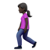 | `:woman-walking::skin-tone-6:`
 | `:mountain_bicyclist:`
 | `:mountain_bicyclist::skin-tone-2:`
 | `:mountain_bicyclist::skin-tone-3:`
 | `:mountain_bicyclist::skin-tone-4:`
 | `:mountain_bicyclist::skin-tone-5:`
 | `:mountain_bicyclist::skin-tone-6:`
 | `:man-mountain-biking:`
 | `:man-mountain-biking::skin-tone-2:`
 | `:man-mountain-biking::skin-tone-3:`
 | `:man-mountain-biking::skin-tone-4:`
 | `:man-mountain-biking::skin-tone-5:`
 | `:man-mountain-biking::skin-tone-6:`
 | `:woman-mountain-biking:`
 | `:woman-mountain-biking::skin-tone-2:`
 | `:woman-mountain-biking::skin-tone-3:`
 | `:woman-mountain-biking::skin-tone-4:`
 | `:woman-mountain-biking::skin-tone-5:`
 | `:woman-mountain-biking::skin-tone-6:`
 | `:bicyclist:`
 | `:bicyclist::skin-tone-2:`
 | `:bicyclist::skin-tone-3:`
 | `:bicyclist::skin-tone-4:`
 | `:bicyclist::skin-tone-5:`
 | `:bicyclist::skin-tone-6:`
 | `:man-biking:`
 | `:man-biking::skin-tone-2:`
 | `:man-biking::skin-tone-3:`
 | `:man-biking::skin-tone-4:`
 | `:man-biking::skin-tone-5:`
 | `:man-biking::skin-tone-6:`
 | `:woman-biking:`
 | `:woman-biking::skin-tone-2:`
 | `:woman-biking::skin-tone-3:`
 | `:woman-biking::skin-tone-4:`
 | `:woman-biking::skin-tone-5:`
 | `:woman-biking::skin-tone-6:`
 | `:rowboat:`
 | `:rowboat::skin-tone-2:`
 | `:rowboat::skin-tone-3:`
 | `:rowboat::skin-tone-4:`
 | `:rowboat::skin-tone-5:`
 | `:rowboat::skin-tone-6:`
 | `:man-rowing-boat:`
 | `:man-rowing-boat::skin-tone-2:`
 | `:man-rowing-boat::skin-tone-3:`
 | `:man-rowing-boat::skin-tone-4:`
 | `:man-rowing-boat::skin-tone-5:`
 | `:man-rowing-boat::skin-tone-6:`
 | `:woman-rowing-boat:`
 | `:woman-rowing-boat::skin-tone-2:`
 | `:woman-rowing-boat::skin-tone-3:`
 | `:woman-rowing-boat::skin-tone-4:`
 | `:woman-rowing-boat::skin-tone-5:`
 | `:woman-rowing-boat::skin-tone-6:`
 | `:pray:`
 | `:pray::skin-tone-2:`
 | `:pray::skin-tone-3:`
 | `:pray::skin-tone-4:`
 | `:pray::skin-tone-5:`
 | `:pray::skin-tone-6:`
 | `:person_with_pouting_face:`
 | `:person_with_pouting_face::skin-tone-2:`
 | `:person_with_pouting_face::skin-tone-3:`
 | `:person_with_pouting_face::skin-tone-4:`
 | `:person_with_pouting_face::skin-tone-5:`
 | `:person_with_pouting_face::skin-tone-6:`
 | `:man-pouting:`
 | `:man-pouting::skin-tone-2:`
 | `:man-pouting::skin-tone-3:`
 | `:man-pouting::skin-tone-4:`
 | `:man-pouting::skin-tone-5:`
 | `:man-pouting::skin-tone-6:`
 | `:woman-pouting:`
 | `:woman-pouting::skin-tone-2:`
 | `:woman-pouting::skin-tone-3:`
 | `:woman-pouting::skin-tone-4:`
 | `:woman-pouting::skin-tone-5:`
 | `:woman-pouting::skin-tone-6:`
 | `:person_frowning:`
 | `:person_frowning::skin-tone-2:`
 | `:person_frowning::skin-tone-3:`
 | `:person_frowning::skin-tone-4:`
 | `:person_frowning::skin-tone-5:`
 | `:person_frowning::skin-tone-6:`
 | `:man-frowning:`
 | `:man-frowning::skin-tone-2:`
 | `:man-frowning::skin-tone-3:`
 | `:man-frowning::skin-tone-4:`
 | `:man-frowning::skin-tone-5:`
 | `:man-frowning::skin-tone-6:`
 | `:woman-frowning:`
 | `:woman-frowning::skin-tone-2:`
 | `:woman-frowning::skin-tone-3:`
 | `:woman-frowning::skin-tone-4:`
 | `:woman-frowning::skin-tone-5:`
 | `:woman-frowning::skin-tone-6:`
 | `:raised_hands:`
 | `:raised_hands::skin-tone-2:`
 | `:raised_hands::skin-tone-3:`
 | `:raised_hands::skin-tone-4:`
 | `:raised_hands::skin-tone-5:`
 | `:raised_hands::skin-tone-6:`
 | `:raising_hand:`
 | `:raising_hand::skin-tone-2:`
 | `:raising_hand::skin-tone-3:`
 | `:raising_hand::skin-tone-4:`
 | `:raising_hand::skin-tone-5:`
 | `:raising_hand::skin-tone-6:`
 | `:man-raising-hand:`
 | `:man-raising-hand::skin-tone-2:`
 | `:man-raising-hand::skin-tone-3:`
 | `:man-raising-hand::skin-tone-4:`
 | `:man-raising-hand::skin-tone-5:`
 | `:man-raising-hand::skin-tone-6:`
 | `:woman-raising-hand:`
 | `:woman-raising-hand::skin-tone-2:`
 | `:woman-raising-hand::skin-tone-3:`
 | `:woman-raising-hand::skin-tone-4:`
 | `:woman-raising-hand::skin-tone-5:`
 | `:woman-raising-hand::skin-tone-6:`
 | `:bow:`
 | `:bow::skin-tone-2:`
 | `:bow::skin-tone-3:`
 | `:bow::skin-tone-4:`
 | `:bow::skin-tone-5:`
 | `:bow::skin-tone-6:`
 | `:man-bowing:`
 | `:man-bowing::skin-tone-2:`
 | `:man-bowing::skin-tone-3:`
 | `:man-bowing::skin-tone-4:`
 | `:man-bowing::skin-tone-5:`
 | `:man-bowing::skin-tone-6:`
 | `:woman-bowing:`
 | `:woman-bowing::skin-tone-2:`
 | `:woman-bowing::skin-tone-3:`
 | `:woman-bowing::skin-tone-4:`
 | `:woman-bowing::skin-tone-5:`
 | `:woman-bowing::skin-tone-6:`
 | `:ok_woman:`
 | `:ok_woman::skin-tone-2:`
 | `:ok_woman::skin-tone-3:`
 | `:ok_woman::skin-tone-4:`
 | `:ok_woman::skin-tone-5:`
 | `:ok_woman::skin-tone-6:`
 | `:man-gesturing-ok:`
 | `:man-gesturing-ok::skin-tone-2:`
 | `:man-gesturing-ok::skin-tone-3:`
 | `:man-gesturing-ok::skin-tone-4:`
 | `:man-gesturing-ok::skin-tone-5:`
 | `:man-gesturing-ok::skin-tone-6:`
 | `:woman-gesturing-ok:`
 | `:woman-gesturing-ok::skin-tone-2:`
 | `:woman-gesturing-ok::skin-tone-3:`
 | `:woman-gesturing-ok::skin-tone-4:`
 | `:woman-gesturing-ok::skin-tone-5:`
 | `:woman-gesturing-ok::skin-tone-6:`
 | `:no_good:`
 | `:no_good::skin-tone-2:`
 | `:no_good::skin-tone-3:`
 | `:no_good::skin-tone-4:`
 | `:no_good::skin-tone-5:`
 | `:no_good::skin-tone-6:`
 | `:man-gesturing-no:`
 | `:man-gesturing-no::skin-tone-2:`
 | `:man-gesturing-no::skin-tone-3:`
 | `:man-gesturing-no::skin-tone-4:`
 | `:man-gesturing-no::skin-tone-5:`
 | `:man-gesturing-no::skin-tone-6:`
 | `:woman-gesturing-no:`
 | `:woman-gesturing-no::skin-tone-2:`
 | `:woman-gesturing-no::skin-tone-3:`
 | `:woman-gesturing-no::skin-tone-4:`
 | `:woman-gesturing-no::skin-tone-5:`
 | `:woman-gesturing-no::skin-tone-6:`
 | `:speaking_head_in_silhouette:`
 | `:spock-hand:`
 | `:spock-hand::skin-tone-2:`
 | `:spock-hand::skin-tone-3:`
 | `:spock-hand::skin-tone-4:`
 | `:spock-hand::skin-tone-5:`
 | `:spock-hand::skin-tone-6:`
 | `:middle_finger:`, `:reversed_hand_with_middle_finger_extended:`
 | `:middle_finger::skin-tone-2:`
 | `:middle_finger::skin-tone-3:`
 | `:middle_finger::skin-tone-4:`
 | `:middle_finger::skin-tone-5:`
 | `:middle_finger::skin-tone-6:`
 | `:raised_hand_with_fingers_splayed:`
 | `:raised_hand_with_fingers_splayed::skin-tone-2:`
 | `:raised_hand_with_fingers_splayed::skin-tone-3:`
 | `:raised_hand_with_fingers_splayed::skin-tone-4:`
 | `:raised_hand_with_fingers_splayed::skin-tone-5:`
 | `:raised_hand_with_fingers_splayed::skin-tone-6:`
 | `:man_dancing:`
 | `:man_dancing::skin-tone-2:`
 | `:man_dancing::skin-tone-3:`
 | `:man_dancing::skin-tone-4:`
 | `:man_dancing::skin-tone-5:`
 | `:man_dancing::skin-tone-6:`
 | `:sleuth_or_spy:`
 | `:sleuth_or_spy::skin-tone-2:`
 | `:sleuth_or_spy::skin-tone-3:`
 | `:sleuth_or_spy::skin-tone-4:`
 | `:sleuth_or_spy::skin-tone-5:`
 | `:sleuth_or_spy::skin-tone-6:`
 | `:male-detective:`
 | `:male-detective::skin-tone-2:`
 | `:male-detective::skin-tone-3:`
 | `:male-detective::skin-tone-4:`
 | `:male-detective::skin-tone-5:`
 | `:male-detective::skin-tone-6:`
 | `:female-detective:`
 | `:female-detective::skin-tone-2:`
 | `:female-detective::skin-tone-3:`
 | `:female-detective::skin-tone-4:`
 | `:female-detective::skin-tone-5:`
 | `:female-detective::skin-tone-6:`
 | `:man_in_business_suit_levitating:`
 | `:man_in_business_suit_levitating::skin-tone-2:`
 | `:man_in_business_suit_levitating::skin-tone-3:`
 | `:man_in_business_suit_levitating::skin-tone-4:`
 | `:man_in_business_suit_levitating::skin-tone-5:`
 | `:man_in_business_suit_levitating::skin-tone-6:`
 | `:muscle:`
 | `:muscle::skin-tone-2:`
 | `:muscle::skin-tone-3:`
 | `:muscle::skin-tone-4:`
 | `:muscle::skin-tone-5:`
 | `:muscle::skin-tone-6:`
 | `:couple_with_heart:`
 | `:couple_with_heart::skin-tone-2:`
 | `:couple_with_heart::skin-tone-3:`
 | `:couple_with_heart::skin-tone-4:`
 | `:couple_with_heart::skin-tone-5:`
 | `:couple_with_heart::skin-tone-6:`
 | `:couple_with_heart::skin-tone-7:`
 | `:couple_with_heart::skin-tone-8:`
 | `:couple_with_heart::skin-tone-9:`
 | `:couple_with_heart::skin-tone-10:`
 | `:couple_with_heart::skin-tone-11:`
 | `:couple_with_heart::skin-tone-12:`
 | `:couple_with_heart::skin-tone-13:`
 | `:couple_with_heart::skin-tone-14:`
 | `:couple_with_heart::skin-tone-15:`
 | `:couple_with_heart::skin-tone-16:`
 | `:couple_with_heart::skin-tone-17:`
 | `:couple_with_heart::skin-tone-18:`
 | `:couple_with_heart::skin-tone-19:`
 | `:couple_with_heart::skin-tone-20:`
 | `:couple_with_heart::skin-tone-21:`
 | `:couple_with_heart::skin-tone-22:`
 | `:couple_with_heart::skin-tone-23:`
 | `:couple_with_heart::skin-tone-24:`
 | `:couple_with_heart::skin-tone-25:`
 | `:couple_with_heart::skin-tone-26:`
 | `:couplekiss:`
 | `:couplekiss::skin-tone-2:`
 | `:couplekiss::skin-tone-3:`
 | `:couplekiss::skin-tone-4:`
 | `:couplekiss::skin-tone-5:`
 | `:couplekiss::skin-tone-6:`
 | `:couplekiss::skin-tone-7:`
 | `:couplekiss::skin-tone-8:`
 | `:couplekiss::skin-tone-9:`
 | `:couplekiss::skin-tone-10:`
 | `:couplekiss::skin-tone-11:`
 | `:couplekiss::skin-tone-12:`
 | `:couplekiss::skin-tone-13:`
 | `:couplekiss::skin-tone-14:`
 | `:couplekiss::skin-tone-15:`
 | `:couplekiss::skin-tone-16:`
 | `:couplekiss::skin-tone-17:`
 | `:couplekiss::skin-tone-18:`
 | `:couplekiss::skin-tone-19:`
 | `:couplekiss::skin-tone-20:`
 | `:couplekiss::skin-tone-21:`
 | `:couplekiss::skin-tone-22:`
 | `:couplekiss::skin-tone-23:`
 | `:couplekiss::skin-tone-24:`
 | `:couplekiss::skin-tone-25:`
 | `:couplekiss::skin-tone-26:`
 | `:haircut:`
 | `:haircut::skin-tone-2:`
 | `:haircut::skin-tone-3:`
 | `:haircut::skin-tone-4:`
 | `:haircut::skin-tone-5:`
 | `:haircut::skin-tone-6:`
 | `:man-getting-haircut:`
 | `:man-getting-haircut::skin-tone-2:`
 | `:man-getting-haircut::skin-tone-3:`
 | `:man-getting-haircut::skin-tone-4:`
 | `:man-getting-haircut::skin-tone-5:`
 | `:man-getting-haircut::skin-tone-6:`
 | `:woman-getting-haircut:`
 | `:woman-getting-haircut::skin-tone-2:`
 | `:woman-getting-haircut::skin-tone-3:`
 | `:woman-getting-haircut::skin-tone-4:`
 | `:woman-getting-haircut::skin-tone-5:`
 | `:woman-getting-haircut::skin-tone-6:`
 | `:massage:`
 | `:massage::skin-tone-2:`
 | `:massage::skin-tone-3:`
 | `:massage::skin-tone-4:`
 | `:massage::skin-tone-5:`
 | `:massage::skin-tone-6:`
 | `:man-getting-massage:`
 | `:man-getting-massage::skin-tone-2:`
 | `:man-getting-massage::skin-tone-3:`
 | `:man-getting-massage::skin-tone-4:`
 | `:man-getting-massage::skin-tone-5:`
 | `:man-getting-massage::skin-tone-6:`
 | `:woman-getting-massage:`
 | `:woman-getting-massage::skin-tone-2:`
 | `:woman-getting-massage::skin-tone-3:`
 | `:woman-getting-massage::skin-tone-4:`
 | `:woman-getting-massage::skin-tone-5:`
 | `:woman-getting-massage::skin-tone-6:`
 | `:nail_care:`
 | `:nail_care::skin-tone-2:`
 | `:nail_care::skin-tone-3:`
 | `:nail_care::skin-tone-4:`
 | `:nail_care::skin-tone-5:`
 | `:nail_care::skin-tone-6:`
 | `:dancer:`
 | `:dancer::skin-tone-2:`
 | `:dancer::skin-tone-3:`
 | `:dancer::skin-tone-4:`
 | `:dancer::skin-tone-5:`
 | `:dancer::skin-tone-6:`
 | `:guardsman:`
 | `:guardsman::skin-tone-2:`
 | `:guardsman::skin-tone-3:`
 | `:guardsman::skin-tone-4:`
 | `:guardsman::skin-tone-5:`
 | `:guardsman::skin-tone-6:`
 | `:male-guard:`
 | `:male-guard::skin-tone-2:`
 | `:male-guard::skin-tone-3:`
 | `:male-guard::skin-tone-4:`
 | `:male-guard::skin-tone-5:`
 | `:male-guard::skin-tone-6:`
 | `:female-guard:`
 | `:female-guard::skin-tone-2:`
 | `:female-guard::skin-tone-3:`
 | `:female-guard::skin-tone-4:`
 | `:female-guard::skin-tone-5:`
 | `:female-guard::skin-tone-6:`
 | `:information_desk_person:`
 | `:information_desk_person::skin-tone-2:`
 | `:information_desk_person::skin-tone-3:`
 | `:information_desk_person::skin-tone-4:`
 | `:information_desk_person::skin-tone-5:`
 | `:information_desk_person::skin-tone-6:`
 | `:man-tipping-hand:`
 | `:man-tipping-hand::skin-tone-2:`
 | `:man-tipping-hand::skin-tone-3:`
 | `:man-tipping-hand::skin-tone-4:`
 | `:man-tipping-hand::skin-tone-5:`
 | `:man-tipping-hand::skin-tone-6:`
 | `:woman-tipping-hand:`
 | `:woman-tipping-hand::skin-tone-2:`
 | `:woman-tipping-hand::skin-tone-3:`
 | `:woman-tipping-hand::skin-tone-4:`
 | `:woman-tipping-hand::skin-tone-5:`
 | `:woman-tipping-hand::skin-tone-6:`
 | `:angel:`
 | `:angel::skin-tone-2:`
 | `:angel::skin-tone-3:`
 | `:angel::skin-tone-4:`
 | `:angel::skin-tone-5:`
 | `:angel::skin-tone-6:`
 | `:princess:`
 | `:princess::skin-tone-2:`
 | `:princess::skin-tone-3:`
 | `:princess::skin-tone-4:`
 | `:princess::skin-tone-5:`
 | `:princess::skin-tone-6:`
 | `:construction_worker:`
 | `:construction_worker::skin-tone-2:`
 | `:construction_worker::skin-tone-3:`
 | `:construction_worker::skin-tone-4:`
 | `:construction_worker::skin-tone-5:`
 | `:construction_worker::skin-tone-6:`
 | `:male-construction-worker:`
 | `:male-construction-worker::skin-tone-2:`
 | `:male-construction-worker::skin-tone-3:`
 | `:male-construction-worker::skin-tone-4:`
 | `:male-construction-worker::skin-tone-5:`
 | `:male-construction-worker::skin-tone-6:`
 | `:female-construction-worker:`
 | `:female-construction-worker::skin-tone-2:`
 | `:female-construction-worker::skin-tone-3:`
 | `:female-construction-worker::skin-tone-4:`
 | `:female-construction-worker::skin-tone-5:`
 | `:female-construction-worker::skin-tone-6:`
 | `:baby:`
 | `:baby::skin-tone-2:`
 | `:baby::skin-tone-3:`
 | `:baby::skin-tone-4:`
 | `:baby::skin-tone-5:`
 | `:baby::skin-tone-6:`
 | `:older_woman:`
 | `:older_woman::skin-tone-2:`
 | `:older_woman::skin-tone-3:`
 | `:older_woman::skin-tone-4:`
 | `:older_woman::skin-tone-5:`
 | `:older_woman::skin-tone-6:`
 | `:older_man:`
 | `:older_man::skin-tone-2:`
 | `:older_man::skin-tone-3:`
 | `:older_man::skin-tone-4:`
 | `:older_man::skin-tone-5:`
 | `:older_man::skin-tone-6:`
 | `:man_with_turban:`
 | `:man_with_turban::skin-tone-2:`
 | `:man_with_turban::skin-tone-3:`
 | `:man_with_turban::skin-tone-4:`
 | `:man_with_turban::skin-tone-5:`
 | `:man_with_turban::skin-tone-6:`
 | `:man-wearing-turban:`
 | `:man-wearing-turban::skin-tone-2:`
 | `:man-wearing-turban::skin-tone-3:`
 | `:man-wearing-turban::skin-tone-4:`
 | `:man-wearing-turban::skin-tone-5:`
 | `:man-wearing-turban::skin-tone-6:`
 | `:woman-wearing-turban:`
 | `:woman-wearing-turban::skin-tone-2:`
 | `:woman-wearing-turban::skin-tone-3:`
 | `:woman-wearing-turban::skin-tone-4:`
 | `:woman-wearing-turban::skin-tone-5:`
 | `:woman-wearing-turban::skin-tone-6:`
 | `:man_with_gua_pi_mao:`
 | `:man_with_gua_pi_mao::skin-tone-2:`
 | `:man_with_gua_pi_mao::skin-tone-3:`
 | `:man_with_gua_pi_mao::skin-tone-4:`
 | `:man_with_gua_pi_mao::skin-tone-5:`
 | `:man_with_gua_pi_mao::skin-tone-6:`
 | `:person_with_blond_hair:`
 | `:person_with_blond_hair::skin-tone-2:`
 | `:person_with_blond_hair::skin-tone-3:`
 | `:person_with_blond_hair::skin-tone-4:`
 | `:person_with_blond_hair::skin-tone-5:`
 | `:person_with_blond_hair::skin-tone-6:`
 | `:blond-haired-man:`
 | `:blond-haired-man::skin-tone-2:`
 | `:blond-haired-man::skin-tone-3:`
 | `:blond-haired-man::skin-tone-4:`
 | `:blond-haired-man::skin-tone-5:`
 | `:blond-haired-man::skin-tone-6:`
 | `:blond-haired-woman:`
 | `:blond-haired-woman::skin-tone-2:`
 | `:blond-haired-woman::skin-tone-3:`
 | `:blond-haired-woman::skin-tone-4:`
 | `:blond-haired-woman::skin-tone-5:`
 | `:blond-haired-woman::skin-tone-6:`
 | `:bride_with_veil:`
 | `:bride_with_veil::skin-tone-2:`
 | `:bride_with_veil::skin-tone-3:`
 | `:bride_with_veil::skin-tone-4:`
 | `:bride_with_veil::skin-tone-5:`
 | `:bride_with_veil::skin-tone-6:`
 | `:man_with_veil:`
 | `:man_with_veil::skin-tone-2:`
 | `:man_with_veil::skin-tone-3:`
 | `:man_with_veil::skin-tone-4:`
 | `:man_with_veil::skin-tone-5:`
 | `:man_with_veil::skin-tone-6:`
 | `:woman_with_veil:`
 | `:woman_with_veil::skin-tone-2:`
 | `:woman_with_veil::skin-tone-3:`
 | `:woman_with_veil::skin-tone-4:`
 | `:woman_with_veil::skin-tone-5:`
 | `:woman_with_veil::skin-tone-6:`
 | `:dancers:`
 | `:men-with-bunny-ears-partying:`, `:man-with-bunny-ears-partying:`
 | `:women-with-bunny-ears-partying:`, `:woman-with-bunny-ears-partying:`
 | `:cop:`
 | `:cop::skin-tone-2:`
 | `:cop::skin-tone-3:`
 | `:cop::skin-tone-4:`
 | `:cop::skin-tone-5:`
 | `:cop::skin-tone-6:`
 | `:male-police-officer:`
 | `:male-police-officer::skin-tone-2:`
 | `:male-police-officer::skin-tone-3:`
 | `:male-police-officer::skin-tone-4:`
 | `:male-police-officer::skin-tone-5:`
 | `:male-police-officer::skin-tone-6:`
 | `:female-police-officer:`
 | `:female-police-officer::skin-tone-2:`
 | `:female-police-officer::skin-tone-3:`
 | `:female-police-officer::skin-tone-4:`
 | `:female-police-officer::skin-tone-5:`
 | `:female-police-officer::skin-tone-6:`
 | `:two_women_holding_hands:`, `:women_holding_hands:`
 | `:two_women_holding_hands::skin-tone-2:`
 | `:two_women_holding_hands::skin-tone-3:`
 | `:two_women_holding_hands::skin-tone-4:`
 | `:two_women_holding_hands::skin-tone-5:`
 | `:two_women_holding_hands::skin-tone-6:`
 | `:two_women_holding_hands::skin-tone-7:`
 | `:two_women_holding_hands::skin-tone-8:`
 | `:two_women_holding_hands::skin-tone-9:`
 | `:two_women_holding_hands::skin-tone-10:`
 | `:two_women_holding_hands::skin-tone-11:`
 | `:two_women_holding_hands::skin-tone-12:`
 | `:two_women_holding_hands::skin-tone-13:`
 | `:two_women_holding_hands::skin-tone-14:`
 | `:two_women_holding_hands::skin-tone-15:`
 | `:two_women_holding_hands::skin-tone-16:`
 | `:two_women_holding_hands::skin-tone-17:`
 | `:two_women_holding_hands::skin-tone-18:`
 | `:two_women_holding_hands::skin-tone-19:`
 | `:two_women_holding_hands::skin-tone-20:`
 | `:two_women_holding_hands::skin-tone-21:`
 | `:two_women_holding_hands::skin-tone-22:`
 | `:two_women_holding_hands::skin-tone-23:`
 | `:two_women_holding_hands::skin-tone-24:`
 | `:two_women_holding_hands::skin-tone-25:`
 | `:two_women_holding_hands::skin-tone-26:`
 | `:two_men_holding_hands:`, `:men_holding_hands:`
 | `:two_men_holding_hands::skin-tone-2:`
 | `:two_men_holding_hands::skin-tone-3:`
 | `:two_men_holding_hands::skin-tone-4:`
 | `:two_men_holding_hands::skin-tone-5:`
 | `:two_men_holding_hands::skin-tone-6:`
 | `:two_men_holding_hands::skin-tone-7:`
 | `:two_men_holding_hands::skin-tone-8:`
 | `:two_men_holding_hands::skin-tone-9:`
 | `:two_men_holding_hands::skin-tone-10:`
 | `:two_men_holding_hands::skin-tone-11:`
 | `:two_men_holding_hands::skin-tone-12:`
 | `:two_men_holding_hands::skin-tone-13:`
 | `:two_men_holding_hands::skin-tone-14:`
 | `:two_men_holding_hands::skin-tone-15:`
 | `:two_men_holding_hands::skin-tone-16:`
 | `:two_men_holding_hands::skin-tone-17:`
 | `:two_men_holding_hands::skin-tone-18:`
 | `:two_men_holding_hands::skin-tone-19:`
 | `:two_men_holding_hands::skin-tone-20:`
 | `:two_men_holding_hands::skin-tone-21:`
 | `:two_men_holding_hands::skin-tone-22:`
 | `:two_men_holding_hands::skin-tone-23:`
 | `:two_men_holding_hands::skin-tone-24:`
 | `:two_men_holding_hands::skin-tone-25:`
 | `:two_men_holding_hands::skin-tone-26:`
 | `:man_and_woman_holding_hands:`, `:woman_and_man_holding_hands:`, `:couple:`
 | `:man_and_woman_holding_hands::skin-tone-2:`
 | `:man_and_woman_holding_hands::skin-tone-3:`
 | `:man_and_woman_holding_hands::skin-tone-4:`
 | `:man_and_woman_holding_hands::skin-tone-5:`
 | `:man_and_woman_holding_hands::skin-tone-6:`
 | `:man_and_woman_holding_hands::skin-tone-7:`
 | `:man_and_woman_holding_hands::skin-tone-8:`
 | `:man_and_woman_holding_hands::skin-tone-9:`
 | `:man_and_woman_holding_hands::skin-tone-10:`
 | `:man_and_woman_holding_hands::skin-tone-11:`
 | `:man_and_woman_holding_hands::skin-tone-12:`
 | `:man_and_woman_holding_hands::skin-tone-13:`
 | `:man_and_woman_holding_hands::skin-tone-14:`
 | `:man_and_woman_holding_hands::skin-tone-15:`
 | `:man_and_woman_holding_hands::skin-tone-16:`
 | `:man_and_woman_holding_hands::skin-tone-17:`
 | `:man_and_woman_holding_hands::skin-tone-18:`
 | `:man_and_woman_holding_hands::skin-tone-19:`
 | `:man_and_woman_holding_hands::skin-tone-20:`
 | `:man_and_woman_holding_hands::skin-tone-21:`
 | `:man_and_woman_holding_hands::skin-tone-22:`
 | `:man_and_woman_holding_hands::skin-tone-23:`
 | `:man_and_woman_holding_hands::skin-tone-24:`
 | `:man_and_woman_holding_hands::skin-tone-25:`
 | `:man_and_woman_holding_hands::skin-tone-26:`
 | `:family:`
 | `:woman:`
 | `:woman::skin-tone-2:`
 | `:woman::skin-tone-3:`
 | `:woman::skin-tone-4:`
 | `:woman::skin-tone-5:`
 | `:woman::skin-tone-6:`
 | `:woman-kiss-woman:`
 | `:woman-kiss-woman::skin-tone-2:`
 | `:woman-kiss-woman::skin-tone-3:`
 | `:woman-kiss-woman::skin-tone-4:`
 | `:woman-kiss-woman::skin-tone-5:`
 | `:woman-kiss-woman::skin-tone-6:`
 | `:woman-kiss-woman::skin-tone-7:`
 | `:woman-kiss-woman::skin-tone-8:`
 | `:woman-kiss-woman::skin-tone-9:`
 | `:woman-kiss-woman::skin-tone-10:`
 | `:woman-kiss-woman::skin-tone-11:`
 | `:woman-kiss-woman::skin-tone-12:`
 | `:woman-kiss-woman::skin-tone-13:`
 | `:woman-kiss-woman::skin-tone-14:`
 | `:woman-kiss-woman::skin-tone-15:`
 | `:woman-kiss-woman::skin-tone-16:`
 | `:woman-kiss-woman::skin-tone-17:`
 | `:woman-kiss-woman::skin-tone-18:`
 | `:woman-kiss-woman::skin-tone-19:`
 | `:woman-kiss-woman::skin-tone-20:`
 | `:woman-kiss-woman::skin-tone-21:`
 | `:woman-kiss-woman::skin-tone-22:`
 | `:woman-kiss-woman::skin-tone-23:`
 | `:woman-kiss-woman::skin-tone-24:`
 | `:woman-kiss-woman::skin-tone-25:`
 | `:woman-kiss-woman::skin-tone-26:`
 | `:woman-kiss-man:`
 | `:woman-kiss-man::skin-tone-2:`
 | `:woman-kiss-man::skin-tone-3:`
 | `:woman-kiss-man::skin-tone-4:`
 | `:woman-kiss-man::skin-tone-5:`
 | `:woman-kiss-man::skin-tone-6:`
 | `:woman-kiss-man::skin-tone-7:`
 | `:woman-kiss-man::skin-tone-8:`
 | `:woman-kiss-man::skin-tone-9:`
 | `:woman-kiss-man::skin-tone-10:`
 | `:woman-kiss-man::skin-tone-11:`
 | `:woman-kiss-man::skin-tone-12:`
 | `:woman-kiss-man::skin-tone-13:`
 | `:woman-kiss-man::skin-tone-14:`
 | `:woman-kiss-man::skin-tone-15:`
 | `:woman-kiss-man::skin-tone-16:`
 | `:woman-kiss-man::skin-tone-17:`
 | `:woman-kiss-man::skin-tone-18:`
 | `:woman-kiss-man::skin-tone-19:`
 | `:woman-kiss-man::skin-tone-20:`
 | `:woman-kiss-man::skin-tone-21:`
 | `:woman-kiss-man::skin-tone-22:`
 | `:woman-kiss-man::skin-tone-23:`
 | `:woman-kiss-man::skin-tone-24:`
 | `:woman-kiss-man::skin-tone-25:`
 | `:woman-kiss-man::skin-tone-26:`
 | `:woman-heart-woman:`
 | `:woman-heart-woman::skin-tone-2:`
 | `:woman-heart-woman::skin-tone-3:`
 | `:woman-heart-woman::skin-tone-4:`
 | `:woman-heart-woman::skin-tone-5:`
 | `:woman-heart-woman::skin-tone-6:`
 | `:woman-heart-woman::skin-tone-7:`
 | `:woman-heart-woman::skin-tone-8:`
 | `:woman-heart-woman::skin-tone-9:`
 | `:woman-heart-woman::skin-tone-10:`
 | `:woman-heart-woman::skin-tone-11:`
 | `:woman-heart-woman::skin-tone-12:`
 | `:woman-heart-woman::skin-tone-13:`
 | `:woman-heart-woman::skin-tone-14:`
 | `:woman-heart-woman::skin-tone-15:`
 | `:woman-heart-woman::skin-tone-16:`
 | `:woman-heart-woman::skin-tone-17:`
 | `:woman-heart-woman::skin-tone-18:`
 | `:woman-heart-woman::skin-tone-19:`
 | `:woman-heart-woman::skin-tone-20:`
 | `:woman-heart-woman::skin-tone-21:`
 | `:woman-heart-woman::skin-tone-22:`
 | `:woman-heart-woman::skin-tone-23:`
 | `:woman-heart-woman::skin-tone-24:`
 | `:woman-heart-woman::skin-tone-25:`
 | `:woman-heart-woman::skin-tone-26:`
 | `:woman-heart-man:`
 | `:woman-heart-man::skin-tone-2:`
 | `:woman-heart-man::skin-tone-3:`
 | `:woman-heart-man::skin-tone-4:`
 | `:woman-heart-man::skin-tone-5:`
 | `:woman-heart-man::skin-tone-6:`
 | `:woman-heart-man::skin-tone-7:`
 | `:woman-heart-man::skin-tone-8:`
 | `:woman-heart-man::skin-tone-9:`
 | `:woman-heart-man::skin-tone-10:`
 | `:woman-heart-man::skin-tone-11:`
 | `:woman-heart-man::skin-tone-12:`
 | `:woman-heart-man::skin-tone-13:`
 | `:woman-heart-man::skin-tone-14:`
 | `:woman-heart-man::skin-tone-15:`
 | `:woman-heart-man::skin-tone-16:`
 | `:woman-heart-man::skin-tone-17:`
 | `:woman-heart-man::skin-tone-18:`
 | `:woman-heart-man::skin-tone-19:`
 | `:woman-heart-man::skin-tone-20:`
 | `:woman-heart-man::skin-tone-21:`
 | `:woman-heart-man::skin-tone-22:`
 | `:woman-heart-man::skin-tone-23:`
 | `:woman-heart-man::skin-tone-24:`
 | `:woman-heart-man::skin-tone-25:`
 | `:woman-heart-man::skin-tone-26:`
 | `:female-pilot:`
 | `:female-pilot::skin-tone-2:`
 | `:female-pilot::skin-tone-3:`
 | `:female-pilot::skin-tone-4:`
 | `:female-pilot::skin-tone-5:`
 | `:female-pilot::skin-tone-6:`
 | `:female-judge:`
 | `:female-judge::skin-tone-2:`
 | `:female-judge::skin-tone-3:`
 | `:female-judge::skin-tone-4:`
 | `:female-judge::skin-tone-5:`
 | `:female-judge::skin-tone-6:`
 | `:female-doctor:`
 | `:female-doctor::skin-tone-2:`
 | `:female-doctor::skin-tone-3:`
 | `:female-doctor::skin-tone-4:`
 | `:female-doctor::skin-tone-5:`
 | `:female-doctor::skin-tone-6:`
 | `:woman_in_manual_wheelchair:`
 | `:woman_in_manual_wheelchair::skin-tone-2:`
 | `:woman_in_manual_wheelchair::skin-tone-3:`
 | `:woman_in_manual_wheelchair::skin-tone-4:`
 | `:woman_in_manual_wheelchair::skin-tone-5:`
 | `:woman_in_manual_wheelchair::skin-tone-6:`
 | `:woman_in_manual_wheelchair_facing_right:`
 | `:woman_in_manual_wheelchair_facing_right::skin-tone-2:`
 | `:woman_in_manual_wheelchair_facing_right::skin-tone-3:`
 | `:woman_in_manual_wheelchair_facing_right::skin-tone-4:`
 | `:woman_in_manual_wheelchair_facing_right::skin-tone-5:`
 | `:woman_in_manual_wheelchair_facing_right::skin-tone-6:`
 | `:woman_in_motorized_wheelchair:`
 | `:woman_in_motorized_wheelchair::skin-tone-2:`
 | `:woman_in_motorized_wheelchair::skin-tone-3:`
 | `:woman_in_motorized_wheelchair::skin-tone-4:`
 | `:woman_in_motorized_wheelchair::skin-tone-5:`
 | `:woman_in_motorized_wheelchair::skin-tone-6:`
 | `:woman_in_motorized_wheelchair_facing_right:`
 | `:woman_in_motorized_wheelchair_facing_right::skin-tone-2:`
 | `:woman_in_motorized_wheelchair_facing_right::skin-tone-3:`
 | `:woman_in_motorized_wheelchair_facing_right::skin-tone-4:`
 | `:woman_in_motorized_wheelchair_facing_right::skin-tone-5:`
 | `:woman_in_motorized_wheelchair_facing_right::skin-tone-6:`
 | `:white_haired_woman:`
 | `:white_haired_woman::skin-tone-2:`
 | `:white_haired_woman::skin-tone-3:`
 | `:white_haired_woman::skin-tone-4:`
 | `:white_haired_woman::skin-tone-5:`
 | `:white_haired_woman::skin-tone-6:`
 | `:bald_woman:`
 | `:bald_woman::skin-tone-2:`
 | `:bald_woman::skin-tone-3:`
 | `:bald_woman::skin-tone-4:`
 | `:bald_woman::skin-tone-5:`
 | `:bald_woman::skin-tone-6:`
 | `:curly_haired_woman:`
 | `:curly_haired_woman::skin-tone-2:`
 | `:curly_haired_woman::skin-tone-3:`
 | `:curly_haired_woman::skin-tone-4:`
 | `:curly_haired_woman::skin-tone-5:`
 | `:curly_haired_woman::skin-tone-6:`
 | `:red_haired_woman:`
 | `:red_haired_woman::skin-tone-2:`
 | `:red_haired_woman::skin-tone-3:`
 | `:red_haired_woman::skin-tone-4:`
 | `:red_haired_woman::skin-tone-5:`
 | `:red_haired_woman::skin-tone-6:`
 | `:woman_with_probing_cane:`
 | `:woman_with_probing_cane::skin-tone-2:`
 | `:woman_with_probing_cane::skin-tone-3:`
 | `:woman_with_probing_cane::skin-tone-4:`
 | `:woman_with_probing_cane::skin-tone-5:`
 | `:woman_with_probing_cane::skin-tone-6:`
 | `:woman_with_white_cane_facing_right:`
 | `:woman_with_white_cane_facing_right::skin-tone-2:`
 | `:woman_with_white_cane_facing_right::skin-tone-3:`
 | `:woman_with_white_cane_facing_right::skin-tone-4:`
 | `:woman_with_white_cane_facing_right::skin-tone-5:`
 | `:woman_with_white_cane_facing_right::skin-tone-6:`
 | `:female-firefighter:`
 | `:female-firefighter::skin-tone-2:`
 | `:female-firefighter::skin-tone-3:`
 | `:female-firefighter::skin-tone-4:`
 | `:female-firefighter::skin-tone-5:`
 | `:female-firefighter::skin-tone-6:`
 | `:female-astronaut:`
 | `:female-astronaut::skin-tone-2:`
 | `:female-astronaut::skin-tone-3:`
 | `:female-astronaut::skin-tone-4:`
 | `:female-astronaut::skin-tone-5:`
 | `:female-astronaut::skin-tone-6:`
 | `:female-scientist:`
 | `:female-scientist::skin-tone-2:`
 | `:female-scientist::skin-tone-3:`
 | `:female-scientist::skin-tone-4:`
 | `:female-scientist::skin-tone-5:`
 | `:female-scientist::skin-tone-6:`
 | `:female-mechanic:`
 | `:female-mechanic::skin-tone-2:`
 | `:female-mechanic::skin-tone-3:`
 | `:female-mechanic::skin-tone-4:`
 | `:female-mechanic::skin-tone-5:`
 | `:female-mechanic::skin-tone-6:`
 | `:female-office-worker:`
 | `:female-office-worker::skin-tone-2:`
 | `:female-office-worker::skin-tone-3:`
 | `:female-office-worker::skin-tone-4:`
 | `:female-office-worker::skin-tone-5:`
 | `:female-office-worker::skin-tone-6:`
 | `:female-technologist:`
 | `:female-technologist::skin-tone-2:`
 | `:female-technologist::skin-tone-3:`
 | `:female-technologist::skin-tone-4:`
 | `:female-technologist::skin-tone-5:`
 | `:female-technologist::skin-tone-6:`
 | `:woman-woman-girl-girl:`
 | `:woman-woman-girl-boy:`
 | `:woman-woman-girl:`
 | `:woman-woman-boy-boy:`
 | `:woman-woman-boy:`
 | `:woman-girl:`
 | `:woman-girl-girl:`
 | `:woman-girl-boy:`
 | `:woman-boy:`
 | `:woman-boy-boy:`
 | `:female-factory-worker:`
 | `:female-factory-worker::skin-tone-2:`
 | `:female-factory-worker::skin-tone-3:`
 | `:female-factory-worker::skin-tone-4:`
 | `:female-factory-worker::skin-tone-5:`
 | `:female-factory-worker::skin-tone-6:`
 | `:female-teacher:`
 | `:female-teacher::skin-tone-2:`
 | `:female-teacher::skin-tone-3:`
 | `:female-teacher::skin-tone-4:`
 | `:female-teacher::skin-tone-5:`
 | `:female-teacher::skin-tone-6:`
 | `:female-artist:`
 | `:female-artist::skin-tone-2:`
 | `:female-artist::skin-tone-3:`
 | `:female-artist::skin-tone-4:`
 | `:female-artist::skin-tone-5:`
 | `:female-artist::skin-tone-6:`
 | `:female-singer:`
 | `:female-singer::skin-tone-2:`
 | `:female-singer::skin-tone-3:`
 | `:female-singer::skin-tone-4:`
 | `:female-singer::skin-tone-5:`
 | `:female-singer::skin-tone-6:`
 | `:female-student:`
 | `:female-student::skin-tone-2:`
 | `:female-student::skin-tone-3:`
 | `:female-student::skin-tone-4:`
 | `:female-student::skin-tone-5:`
 | `:female-student::skin-tone-6:`
 | `:woman_feeding_baby:`
 | `:woman_feeding_baby::skin-tone-2:`
 | `:woman_feeding_baby::skin-tone-3:`
 | `:woman_feeding_baby::skin-tone-4:`
 | `:woman_feeding_baby::skin-tone-5:`
 | `:woman_feeding_baby::skin-tone-6:`
 | `:female-cook:`
 | `:female-cook::skin-tone-2:`
 | `:female-cook::skin-tone-3:`
 | `:female-cook::skin-tone-4:`
 | `:female-cook::skin-tone-5:`
 | `:female-cook::skin-tone-6:`
 | `:female-farmer:`
 | `:female-farmer::skin-tone-2:`
 | `:female-farmer::skin-tone-3:`
 | `:female-farmer::skin-tone-4:`
 | `:female-farmer::skin-tone-5:`
 | `:female-farmer::skin-tone-6:`
 | `:man:`
 | `:man::skin-tone-2:`
 | `:man::skin-tone-3:`
 | `:man::skin-tone-4:`
 | `:man::skin-tone-5:`
 | `:man::skin-tone-6:`
 | `:man-kiss-man:`
 | `:man-kiss-man::skin-tone-2:`
 | `:man-kiss-man::skin-tone-3:`
 | `:man-kiss-man::skin-tone-4:`
 | `:man-kiss-man::skin-tone-5:`
 | `:man-kiss-man::skin-tone-6:`
 | `:man-kiss-man::skin-tone-7:`
 | `:man-kiss-man::skin-tone-8:`
 | `:man-kiss-man::skin-tone-9:`
 | `:man-kiss-man::skin-tone-10:`
 | `:man-kiss-man::skin-tone-11:`
 | `:man-kiss-man::skin-tone-12:`
 | `:man-kiss-man::skin-tone-13:`
 | `:man-kiss-man::skin-tone-14:`
 | `:man-kiss-man::skin-tone-15:`
 | `:man-kiss-man::skin-tone-16:`
 | `:man-kiss-man::skin-tone-17:`
 | `:man-kiss-man::skin-tone-18:`
 | `:man-kiss-man::skin-tone-19:`
 | `:man-kiss-man::skin-tone-20:`
 | `:man-kiss-man::skin-tone-21:`
 | `:man-kiss-man::skin-tone-22:`
 | `:man-kiss-man::skin-tone-23:`
 | `:man-kiss-man::skin-tone-24:`
 | `:man-kiss-man::skin-tone-25:`
 | `:man-kiss-man::skin-tone-26:`
 | `:man-heart-man:`
 | `:man-heart-man::skin-tone-2:`
 | `:man-heart-man::skin-tone-3:`
 | `:man-heart-man::skin-tone-4:`
 | `:man-heart-man::skin-tone-5:`
 | `:man-heart-man::skin-tone-6:`
 | `:man-heart-man::skin-tone-7:`
 | `:man-heart-man::skin-tone-8:`
 | `:man-heart-man::skin-tone-9:`
 | `:man-heart-man::skin-tone-10:`
 | `:man-heart-man::skin-tone-11:`
 | `:man-heart-man::skin-tone-12:`
 | `:man-heart-man::skin-tone-13:`
 | `:man-heart-man::skin-tone-14:`
 | `:man-heart-man::skin-tone-15:`
 | `:man-heart-man::skin-tone-16:`
 | `:man-heart-man::skin-tone-17:`
 | `:man-heart-man::skin-tone-18:`
 | `:man-heart-man::skin-tone-19:`
 | `:man-heart-man::skin-tone-20:`
 | `:man-heart-man::skin-tone-21:`
 | `:man-heart-man::skin-tone-22:`
 | `:man-heart-man::skin-tone-23:`
 | `:man-heart-man::skin-tone-24:`
 | `:man-heart-man::skin-tone-25:`
 | `:man-heart-man::skin-tone-26:`
 | `:male-pilot:`
 | `:male-pilot::skin-tone-2:`
 | `:male-pilot::skin-tone-3:`
 | `:male-pilot::skin-tone-4:`
 | `:male-pilot::skin-tone-5:`
 | `:male-pilot::skin-tone-6:`
 | `:male-judge:`
 | `:male-judge::skin-tone-2:`
 | `:male-judge::skin-tone-3:`
 | `:male-judge::skin-tone-4:`
 | `:male-judge::skin-tone-5:`
 | `:male-judge::skin-tone-6:`
 | `:male-doctor:`
 | `:male-doctor::skin-tone-2:`
 | `:male-doctor::skin-tone-3:`
 | `:male-doctor::skin-tone-4:`
 | `:male-doctor::skin-tone-5:`
 | `:male-doctor::skin-tone-6:`
 | `:man_in_manual_wheelchair:`
 | `:man_in_manual_wheelchair::skin-tone-2:`
 | `:man_in_manual_wheelchair::skin-tone-3:`
 | `:man_in_manual_wheelchair::skin-tone-4:`
 | `:man_in_manual_wheelchair::skin-tone-5:`
 | `:man_in_manual_wheelchair::skin-tone-6:`
 | `:man_in_manual_wheelchair_facing_right:`
 | `:man_in_manual_wheelchair_facing_right::skin-tone-2:`
 | `:man_in_manual_wheelchair_facing_right::skin-tone-3:`
 | `:man_in_manual_wheelchair_facing_right::skin-tone-4:`
 | `:man_in_manual_wheelchair_facing_right::skin-tone-5:`
 | `:man_in_manual_wheelchair_facing_right::skin-tone-6:`
 | `:man_in_motorized_wheelchair:`
 | `:man_in_motorized_wheelchair::skin-tone-2:`
 | `:man_in_motorized_wheelchair::skin-tone-3:`
 | `:man_in_motorized_wheelchair::skin-tone-4:`
 | `:man_in_motorized_wheelchair::skin-tone-5:`
 | `:man_in_motorized_wheelchair::skin-tone-6:`
 | `:man_in_motorized_wheelchair_facing_right:`
 | `:man_in_motorized_wheelchair_facing_right::skin-tone-2:`
 | `:man_in_motorized_wheelchair_facing_right::skin-tone-3:`
 | `:man_in_motorized_wheelchair_facing_right::skin-tone-4:`
 | `:man_in_motorized_wheelchair_facing_right::skin-tone-5:`
 | `:man_in_motorized_wheelchair_facing_right::skin-tone-6:`
 | `:white_haired_man:`
 | `:white_haired_man::skin-tone-2:`
 | `:white_haired_man::skin-tone-3:`
 | `:white_haired_man::skin-tone-4:`
 | `:white_haired_man::skin-tone-5:`
 | `:white_haired_man::skin-tone-6:`
 | `:bald_man:`
 | `:bald_man::skin-tone-2:`
 | `:bald_man::skin-tone-3:`
 | `:bald_man::skin-tone-4:`
 | `:bald_man::skin-tone-5:`
 | `:bald_man::skin-tone-6:`
 | `:curly_haired_man:`
 | `:curly_haired_man::skin-tone-2:`
 | `:curly_haired_man::skin-tone-3:`
 | `:curly_haired_man::skin-tone-4:`
 | `:curly_haired_man::skin-tone-5:`
 | `:curly_haired_man::skin-tone-6:`
 | `:red_haired_man:`
 | `:red_haired_man::skin-tone-2:`
 | `:red_haired_man::skin-tone-3:`
 | `:red_haired_man::skin-tone-4:`
 | `:red_haired_man::skin-tone-5:`
 | `:red_haired_man::skin-tone-6:`
 | `:man_with_probing_cane:`
 | `:man_with_probing_cane::skin-tone-2:`
 | `:man_with_probing_cane::skin-tone-3:`
 | `:man_with_probing_cane::skin-tone-4:`
 | `:man_with_probing_cane::skin-tone-5:`
 | `:man_with_probing_cane::skin-tone-6:`
 | `:man_with_white_cane_facing_right:`
 | `:man_with_white_cane_facing_right::skin-tone-2:`
 | `:man_with_white_cane_facing_right::skin-tone-3:`
 | `:man_with_white_cane_facing_right::skin-tone-4:`
 | `:man_with_white_cane_facing_right::skin-tone-5:`
 | `:man_with_white_cane_facing_right::skin-tone-6:`
 | `:male-firefighter:`
 | `:male-firefighter::skin-tone-2:`
 | `:male-firefighter::skin-tone-3:`
 | `:male-firefighter::skin-tone-4:`
 | `:male-firefighter::skin-tone-5:`
 | `:male-firefighter::skin-tone-6:`
 | `:male-astronaut:`
 | `:male-astronaut::skin-tone-2:`
 | `:male-astronaut::skin-tone-3:`
 | `:male-astronaut::skin-tone-4:`
 | `:male-astronaut::skin-tone-5:`
 | `:male-astronaut::skin-tone-6:`
 | `:male-scientist:`
 | `:male-scientist::skin-tone-2:`
 | `:male-scientist::skin-tone-3:`
 | `:male-scientist::skin-tone-4:`
 | `:male-scientist::skin-tone-5:`
 | `:male-scientist::skin-tone-6:`
 | `:male-mechanic:`
 | `:male-mechanic::skin-tone-2:`
 | `:male-mechanic::skin-tone-3:`
 | `:male-mechanic::skin-tone-4:`
 | `:male-mechanic::skin-tone-5:`
 | `:male-mechanic::skin-tone-6:`
 | `:male-office-worker:`
 | `:male-office-worker::skin-tone-2:`
 | `:male-office-worker::skin-tone-3:`
 | `:male-office-worker::skin-tone-4:`
 | `:male-office-worker::skin-tone-5:`
 | `:male-office-worker::skin-tone-6:`
 | `:male-technologist:`
 | `:male-technologist::skin-tone-2:`
 | `:male-technologist::skin-tone-3:`
 | `:male-technologist::skin-tone-4:`
 | `:male-technologist::skin-tone-5:`
 | `:male-technologist::skin-tone-6:`
 | `:man-woman-girl-girl:`
 | `:man-woman-girl-boy:`
 | `:man-woman-girl:`
 | `:man-woman-boy-boy:`
 | `:man-woman-boy:`
 | `:man-man-girl-girl:`
 | `:man-man-girl-boy:`
 | `:man-man-girl:`
 | `:man-man-boy-boy:`
 | `:man-man-boy:`
 | `:man-girl:`
 | `:man-girl-girl:`
 | `:man-girl-boy:`
 | `:man-boy:`
 | `:man-boy-boy:`
 | `:male-factory-worker:`
 | `:male-factory-worker::skin-tone-2:`
 | `:male-factory-worker::skin-tone-3:`
 | `:male-factory-worker::skin-tone-4:`
 | `:male-factory-worker::skin-tone-5:`
 | `:male-factory-worker::skin-tone-6:`
 | `:male-teacher:`
 | `:male-teacher::skin-tone-2:`
 | `:male-teacher::skin-tone-3:`
 | `:male-teacher::skin-tone-4:`
 | `:male-teacher::skin-tone-5:`
 | `:male-teacher::skin-tone-6:`
 | `:male-artist:`
 | `:male-artist::skin-tone-2:`
 | `:male-artist::skin-tone-3:`
 | `:male-artist::skin-tone-4:`
 | `:male-artist::skin-tone-5:`
 | `:male-artist::skin-tone-6:`
 | `:male-singer:`
 | `:male-singer::skin-tone-2:`
 | `:male-singer::skin-tone-3:`
 | `:male-singer::skin-tone-4:`
 | `:male-singer::skin-tone-5:`
 | `:male-singer::skin-tone-6:`
 | `:male-student:`
 | `:male-student::skin-tone-2:`
 | `:male-student::skin-tone-3:`
 | `:male-student::skin-tone-4:`
 | `:male-student::skin-tone-5:`
 | `:male-student::skin-tone-6:`
 | `:man_feeding_baby:`
 | `:man_feeding_baby::skin-tone-2:`
 | `:man_feeding_baby::skin-tone-3:`
 | `:man_feeding_baby::skin-tone-4:`
 | `:man_feeding_baby::skin-tone-5:`
 | `:man_feeding_baby::skin-tone-6:`
 | `:male-cook:`
 | `:male-cook::skin-tone-2:`
 | `:male-cook::skin-tone-3:`
 | `:male-cook::skin-tone-4:`
 | `:male-cook::skin-tone-5:`
 | `:male-cook::skin-tone-6:`
 | `:male-farmer:`
 | `:male-farmer::skin-tone-2:`
 | `:male-farmer::skin-tone-3:`
 | `:male-farmer::skin-tone-4:`
 | `:male-farmer::skin-tone-5:`
 | `:male-farmer::skin-tone-6:`
 | `:girl:`
 | `:girl::skin-tone-2:`
 | `:girl::skin-tone-3:`
 | `:girl::skin-tone-4:`
 | `:girl::skin-tone-5:`
 | `:girl::skin-tone-6:`
 | `:boy:`
 | `:boy::skin-tone-2:`
 | `:boy::skin-tone-3:`
 | `:boy::skin-tone-4:`
 | `:boy::skin-tone-5:`
 | `:boy::skin-tone-6:`
 | `:busts_in_silhouette:`
 | `:bust_in_silhouette:`
 | `:footprints:`
 | `:open_hands:`
 | `:open_hands::skin-tone-2:`
 | `:open_hands::skin-tone-3:`
 | `:open_hands::skin-tone-4:`
 | `:open_hands::skin-tone-5:`
 | `:open_hands::skin-tone-6:`
 | `:clap:`
 | `:clap::skin-tone-2:`
 | `:clap::skin-tone-3:`
 | `:clap::skin-tone-4:`
 | `:clap::skin-tone-5:`
 | `:clap::skin-tone-6:`
 | `:-1:`, `:thumbsdown:`
 | `:-1::skin-tone-2:`
 | `:-1::skin-tone-3:`
 | `:-1::skin-tone-4:`
 | `:-1::skin-tone-5:`
 | `:-1::skin-tone-6:`
 | `:+1:`, `:thumbsup:`
 | `:+1::skin-tone-2:`
 | `:+1::skin-tone-3:`
 | `:+1::skin-tone-4:`
 | `:+1::skin-tone-5:`
 | `:+1::skin-tone-6:`
 | `:ok_hand:`
 | `:ok_hand::skin-tone-2:`
 | `:ok_hand::skin-tone-3:`
 | `:ok_hand::skin-tone-4:`
 | `:ok_hand::skin-tone-5:`
 | `:ok_hand::skin-tone-6:`
 | `:wave:`
 | `:wave::skin-tone-2:`
 | `:wave::skin-tone-3:`
 | `:wave::skin-tone-4:`
 | `:wave::skin-tone-5:`
 | `:wave::skin-tone-6:`
 | `:facepunch:`, `:punch:`
 | `:facepunch::skin-tone-2:`
 | `:facepunch::skin-tone-3:`
 | `:facepunch::skin-tone-4:`
 | `:facepunch::skin-tone-5:`
 | `:facepunch::skin-tone-6:`
 | `:point_right:`
 | `:point_right::skin-tone-2:`
 | `:point_right::skin-tone-3:`
 | `:point_right::skin-tone-4:`
 | `:point_right::skin-tone-5:`
 | `:point_right::skin-tone-6:`
 | `:point_left:`
 | `:point_left::skin-tone-2:`
 | `:point_left::skin-tone-3:`
 | `:point_left::skin-tone-4:`
 | `:point_left::skin-tone-5:`
 | `:point_left::skin-tone-6:`
 | `:point_down:`
 | `:point_down::skin-tone-2:`
 | `:point_down::skin-tone-3:`
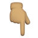 | `:point_down::skin-tone-4:`
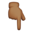 | `:point_down::skin-tone-5:`
 | `:point_down::skin-tone-6:`
 | `:point_up_2:`
 | `:point_up_2::skin-tone-2:`
 | `:point_up_2::skin-tone-3:`
 | `:point_up_2::skin-tone-4:`
 | `:point_up_2::skin-tone-5:`
 | `:point_up_2::skin-tone-6:`
 | `:tongue:`
 | `:lips:`
 | `:nose:`
 | `:nose::skin-tone-2:`
 | `:nose::skin-tone-3:`
 | `:nose::skin-tone-4:`
 | `:nose::skin-tone-5:`
 | `:nose::skin-tone-6:`
 | `:ear:`
 | `:ear::skin-tone-2:`
 | `:ear::skin-tone-3:`
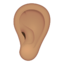 | `:ear::skin-tone-4:`
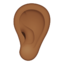 | `:ear::skin-tone-5:`
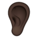 | `:ear::skin-tone-6:`
 | `:eye:`
 | `:eyes:`
 | `:golfer:`
 | `:golfer::skin-tone-2:`
 | `:golfer::skin-tone-3:`
 | `:golfer::skin-tone-4:`
 | `:golfer::skin-tone-5:`
 | `:golfer::skin-tone-6:`
 | `:man-golfing:`
 | `:man-golfing::skin-tone-2:`
 | `:man-golfing::skin-tone-3:`
 | `:man-golfing::skin-tone-4:`
 | `:man-golfing::skin-tone-5:`
 | `:man-golfing::skin-tone-6:`
 | `:woman-golfing:`
 | `:woman-golfing::skin-tone-2:`
 | `:woman-golfing::skin-tone-3:`
 | `:woman-golfing::skin-tone-4:`
 | `:woman-golfing::skin-tone-5:`
 | `:woman-golfing::skin-tone-6:`
 | `:weight_lifter:`
 | `:weight_lifter::skin-tone-2:`
 | `:weight_lifter::skin-tone-3:`
 | `:weight_lifter::skin-tone-4:`
 | `:weight_lifter::skin-tone-5:`
 | `:weight_lifter::skin-tone-6:`
 | `:man-lifting-weights:`
 | `:man-lifting-weights::skin-tone-2:`
 | `:man-lifting-weights::skin-tone-3:`
 | `:man-lifting-weights::skin-tone-4:`
 | `:man-lifting-weights::skin-tone-5:`
 | `:man-lifting-weights::skin-tone-6:`
 | `:woman-lifting-weights:`
 | `:woman-lifting-weights::skin-tone-2:`
 | `:woman-lifting-weights::skin-tone-3:`
 | `:woman-lifting-weights::skin-tone-4:`
 | `:woman-lifting-weights::skin-tone-5:`
 | `:woman-lifting-weights::skin-tone-6:`
 | `:swimmer:`
 | `:swimmer::skin-tone-2:`
 | `:swimmer::skin-tone-3:`
 | `:swimmer::skin-tone-4:`
 | `:swimmer::skin-tone-5:`
 | `:swimmer::skin-tone-6:`
 | `:man-swimming:`
 | `:man-swimming::skin-tone-2:`
 | `:man-swimming::skin-tone-3:`
 | `:man-swimming::skin-tone-4:`
 | `:man-swimming::skin-tone-5:`
 | `:man-swimming::skin-tone-6:`
 | `:woman-swimming:`
 | `:woman-swimming::skin-tone-2:`
 | `:woman-swimming::skin-tone-3:`
 | `:woman-swimming::skin-tone-4:`
 | `:woman-swimming::skin-tone-5:`
 | `:woman-swimming::skin-tone-6:`
 | `:horse_racing:`
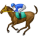 | `:horse_racing::skin-tone-2:`
 | `:horse_racing::skin-tone-3:`
 | `:horse_racing::skin-tone-4:`
 | `:horse_racing::skin-tone-5:`
 | `:horse_racing::skin-tone-6:`
 | `:surfer:`
 | `:surfer::skin-tone-2:`
 | `:surfer::skin-tone-3:`
 | `:surfer::skin-tone-4:`
 | `:surfer::skin-tone-5:`
 | `:surfer::skin-tone-6:`
 | `:man-surfing:`
 | `:man-surfing::skin-tone-2:`
 | `:man-surfing::skin-tone-3:`
 | `:man-surfing::skin-tone-4:`
 | `:man-surfing::skin-tone-5:`
 | `:man-surfing::skin-tone-6:`
 | `:woman-surfing:`
 | `:woman-surfing::skin-tone-2:`
 | `:woman-surfing::skin-tone-3:`
 | `:woman-surfing::skin-tone-4:`
 | `:woman-surfing::skin-tone-5:`
 | `:woman-surfing::skin-tone-6:`
 | `:runner:`, `:running:`
 | `:runner::skin-tone-2:`
 | `:runner::skin-tone-3:`
 | `:runner::skin-tone-4:`
 | `:runner::skin-tone-5:`
 | `:runner::skin-tone-6:`
 | `:person_running_facing_right:`
 | `:person_running_facing_right::skin-tone-2:`
 | `:person_running_facing_right::skin-tone-3:`
 | `:person_running_facing_right::skin-tone-4:`
 | `:person_running_facing_right::skin-tone-5:`
 | `:person_running_facing_right::skin-tone-6:`
 | `:man_running_facing_right:`
 | `:man_running_facing_right::skin-tone-2:`
 | `:man_running_facing_right::skin-tone-3:`
 | `:man_running_facing_right::skin-tone-4:`
 | `:man_running_facing_right::skin-tone-5:`
 | `:man_running_facing_right::skin-tone-6:`
 | `:man-running:`
 | `:man-running::skin-tone-2:`
 | `:man-running::skin-tone-3:`
 | `:man-running::skin-tone-4:`
 | `:man-running::skin-tone-5:`
 | `:man-running::skin-tone-6:`
 | `:woman_running_facing_right:`
 | `:woman_running_facing_right::skin-tone-2:`
 | `:woman_running_facing_right::skin-tone-3:`
 | `:woman_running_facing_right::skin-tone-4:`
 | `:woman_running_facing_right::skin-tone-5:`
 | `:woman_running_facing_right::skin-tone-6:`
 | `:woman-running:`
 | `:woman-running::skin-tone-2:`
 | `:woman-running::skin-tone-3:`
 | `:woman-running::skin-tone-4:`
 | `:woman-running::skin-tone-5:`
 | `:woman-running::skin-tone-6:`
 | `:snowboarder:`
 | `:snowboarder::skin-tone-2:`
 | `:snowboarder::skin-tone-3:`
 | `:snowboarder::skin-tone-4:`
 | `:snowboarder::skin-tone-5:`
 | `:snowboarder::skin-tone-6:`
 | `:santa:`
 | `:santa::skin-tone-2:`
 | `:santa::skin-tone-3:`
 | `:santa::skin-tone-4:`
 | `:santa::skin-tone-5:`
 | `:santa::skin-tone-6:`

### Animals & Nature

Emoji | Aliases
----- | -------
 | `:shamrock:`
 | `:donkey:`
 | `:moose:`
 | `:goose:`
 | `:wing:`
 | `:jellyfish:`
 | `:hyacinth:`
 | `:nest_with_eggs:`
 | `:empty_nest:`
 | `:coral:`
 | `:lotus:`
 | `:feather:`
 | `:potted_plant:`
 | `:cockroach:`
 | `:beetle:`
 | `:worm:`
 | `:fly:`
 | `:guide_dog:`
 | `:seal:`
 | `:bison:`
 | `:beaver:`
 | `:flamingo:`
 | `:skunk:`
 | `:orangutan:`
 | `:otter:`
 | `:sloth:`
 | `:dodo:`
 | `:mammoth:`
 | `:swan:`
 | `:badger:`
 | `:microbe:`
 | `:mosquito:`
 | `:raccoon:`
 | `:parrot:`
 | `:hippopotamus:`
 | `:peacock:`
 | `:llama:`
 | `:kangaroo:`
 | `:cricket:`
 | `:t-rex:`
 | `:sauropod:`
 | `:hedgehog:`
 | `:zebra_face:`
 | `:giraffe_face:`
 | `:rhinoceros:`
 | `:lizard:`
 | `:gorilla:`
 | `:deer:`
 | `:butterfly:`
 | `:fox_face:`
 | `:owl:`
 | `:shark:`
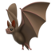 | `:bat:`
 | `:duck:`
 | `:eagle:`
 | `:unicorn_face:`
 | `:turkey:`
 | `:scorpion:`
 | `:lion_face:`
 | `:wilted_flower:`
 | `:spider_web:`
 | `:spider:`
 | `:dove_of_peace:`
 | `:white_flower:`
 | `:bouquet:`
 | `:chipmunk:`
 | `:feet:`, `:paw_prints:`
 | `:pig_nose:`
 | `:panda_face:`
 | `:bear:`
 | `:polar_bear:`
 | `:wolf:`
 | `:hamster:`
 | `:frog:`
 | `:pig:`
 | `:dog:`
 | `:monkey_face:`
 | `:horse:`
 | `:whale:`
 | `:dragon_face:`
 | `:cat:`
 | `:rabbit:`
 | `:tiger:`
 | `:cow:`
 | `:mouse:`
 | `:dolphin:`, `:flipper:`
 | `:camel:`
 | `:dromedary_camel:`
 | `:poodle:`
 | `:koala:`
 | `:penguin:`
 | `:bird:`
 | `:black_bird:`
 | `:phoenix:`
 | `:hatched_chick:`
 | `:baby_chick:`
 | `:hatching_chick:`
 | `:turtle:`
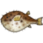 | `:blowfish:`
 | `:tropical_fish:`
 | `:fish:`
 | `:ladybug:`, `:lady_beetle:`
 | `:bee:`, `:honeybee:`
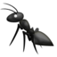 | `:ant:`
 | `:bug:`
 | `:shell:`
 | `:octopus:`
 | `:elephant:`
 | `:boar:`
 | `:pig2:`
 | `:dog2:`
 | `:service_dog:`
 | `:chicken:`
 | `:rooster:`
 | `:monkey:`
 | `:sheep:`
 | `:goat:`
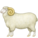 | `:ram:`
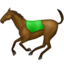 | `:racehorse:`
 | `:snake:`
 | `:snail:`
 | `:whale2:`
 | `:crocodile:`
 | `:dragon:`
 | `:cat2:`
 | `:black_cat:`
 | `:rabbit2:`
 | `:leopard:`
 | `:tiger2:`
 | `:cow2:`
 | `:water_buffalo:`
 | `:ox:`
 | `:mouse2:`
 | `:rat:`
 | `:rosette:`
 | `:mushroom:`
 | `:leaves:`
 | `:fallen_leaf:`
 | `:maple_leaf:`
 | `:four_leaf_clover:`
 | `:herb:`
 | `:ear_of_rice:`
 | `:blossom:`
 | `:sunflower:`
 | `:hibiscus:`
 | `:rose:`
 | `:cherry_blossom:`
 | `:tulip:`
 | `:cactus:`
 | `:palm_tree:`
 | `:deciduous_tree:`
 | `:evergreen_tree:`
 | `:seedling:`

### Food & Drink

Emoji | Aliases
----- | -------
 | `:coffee:`
 | `:pea_pod:`
 | `:ginger_root:`
 | `:jar:`
 | `:beans:`
 | `:pouring_liquid:`
 | `:teapot:`
 | `:fondue:`
 | `:tamale:`
 | `:flatbread:`
 | `:olive:`
 | `:bell_pepper:`
 | `:blueberries:`
 | `:bubble_tea:`
 | `:ice_cube:`
 | `:mate_drink:`
 | `:butter:`
 | `:waffle:`
 | `:falafel:`
 | `:onion:`
 | `:garlic:`
 | `:beverage_box:`
 | `:salt:`
 | `:cupcake:`
 | `:cheese_wedge:`
 | `:oyster:`
 | `:lobster:`
 | `:squid:`
 | `:shrimp:`
 | `:crab:`
 | `:bagel:`
 | `:moon_cake:`
 | `:mango:`
 | `:leafy_green:`
 | `:canned_food:`
 | `:sandwich:`
 | `:cut_of_meat:`
 | `:pretzel:`
 | `:pie:`
 | `:broccoli:`
 | `:coconut:`
 | `:cup_with_straw:`
 | `:bowl_with_spoon:`
 | `:chopsticks:`
 | `:takeout_box:`
 | `:fortune_cookie:`
 | `:dumpling:`
 | `:pancakes:`
 | `:kiwifruit:`
 | `:peanuts:`
 | `:glass_of_milk:`
 | `:egg:`
 | `:stuffed_flatbread:`
 | `:shallow_pan_of_food:`
 | `:green_salad:`
 | `:baguette_bread:`
 | `:carrot:`
 | `:potato:`
 | `:bacon:`
 | `:cucumber:`
 | `:avocado:`
 | `:croissant:`
 | `:spoon:`
 | `:tumbler_glass:`
 | `:clinking_glasses:`
 | `:hocho:`, `:knife:`
 | `:amphora:`
 | `:birthday:`
 | `:popcorn:`
 | `:champagne:`
 | `:knife_fork_plate:`
 | `:baby_bottle:`
 | `:beers:`
 | `:beer:`
 | `:tropical_drink:`
 | `:cocktail:`
 | `:wine_glass:`
 | `:sake:`
 | `:tea:`
 | `:fork_and_knife:`
 | `:fried_egg:`, `:cooking:`
 | `:stew:`
 | `:bento:`
 | `:cake:`
 | `:honey_pot:`
 | `:custard:`
 | `:lollipop:`
 | `:candy:`
 | `:chocolate_bar:`
 | `:cookie:`
 | `:doughnut:`
 | `:ice_cream:`
 | `:shaved_ice:`
 | `:icecream:`
 | `:fish_cake:`
 | `:fried_shrimp:`
 | `:sushi:`
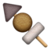 | `:oden:`
 | `:dango:`
 | `:sweet_potato:`
 | `:fries:`
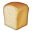 | `:bread:`
 | `:spaghetti:`
 | `:ramen:`
 | `:curry:`
 | `:rice:`
 | `:rice_ball:`
 | `:rice_cracker:`
 | `:poultry_leg:`
 | `:meat_on_bone:`
 | `:pizza:`
 | `:hamburger:`
 | `:strawberry:`
 | `:cherries:`
 | `:peach:`
 | `:pear:`
 | `:green_apple:`
 | `:apple:`
 | `:pineapple:`
 | `:banana:`
 | `:lemon:`
 | `:lime:`
 | `:tangerine:`
 | `:watermelon:`
 | `:melon:`
 | `:grapes:`
 | `:eggplant:`
 | `:tomato:`
 | `:brown_mushroom:`
 | `:corn:`
 | `:hot_pepper:`
 | `:chestnut:`
 | `:burrito:`
 | `:taco:`
 | `:hotdog:`

### Activities

Emoji | Aliases
----- | -------
 | `:sparkles:`
 | `:ice_skate:`
 | `:golf:`
 | `:baseball:`
 | `:soccer:`
 | `:diamonds:`
 | `:hearts:`
 | `:clubs:`
 | `:spades:`
 | `:chess_pawn:`
 | `:mirror_ball:`
 | `:knot:`
 | `:sewing_needle:`
 | `:nesting_dolls:`
 | `:pinata:`
 | `:magic_wand:`
 | `:kite:`
 | `:yo-yo:`
 | `:teddy_bear:`
 | `:yarn:`
 | `:thread:`
 | `:jigsaw:`
 | `:firecracker:`
 | `:red_envelope:`
 | `:flying_disc:`
 | `:softball:`
 | `:lacrosse:`
 | `:curling_stone:`
 | `:martial_arts_uniform:`
 | `:boxing_glove:`
 | `:third_place_medal:`
 | `:second_place_medal:`
 | `:first_place_medal:`
 | `:goal_net:`
 | `:diving_mask:`
 | `:sled:`
 | `:frame_with_picture:`
 | `:joystick:`
 | `:crystal_ball:`
 | `:gun:`
 | `:badminton_racquet_and_shuttlecock:`
 | `:table_tennis_paddle_and_ball:`
 | `:ice_hockey_stick_and_puck:`
 | `:field_hockey_stick_and_ball:`
 | `:volleyball:`
 | `:cricket_bat_and_ball:`
 | `:rugby_football:`
 | `:football:`
 | `:trophy:`
 | `:sports_medal:`
 | `:basketball:`
 | `:ski:`
 | `:tennis:`
 | `:running_shirt_with_sash:`
 | `:flower_playing_cards:`
 | `:bowling:`
 | `:game_die:`
 | `:8ball:`
 | `:slot_machine:`
 | `:dart:`
 | `:video_game:`
 | `:performing_arts:`
 | `:ticket:`
 | `:art:`
 | `:fishing_pole_and_fish:`
 | `:admission_tickets:`
 | `:reminder_ribbon:`
 | `:medal:`
 | `:rice_scene:`
 | `:wind_chime:`
 | `:flags:`
 | `:dolls:`
 | `:bamboo:`
 | `:tanabata_tree:`
 | `:confetti_ball:`
 | `:tada:`
 | `:balloon:`
 | `:sparkler:`
 | `:fireworks:`
 | `:christmas_tree:`
 | `:jack_o_lantern:`
 | `:gift:`
 | `:ribbon:`
 | `:black_joker:`
 | `:mahjong:`

### Travel & Places

Emoji | Aliases
----- | -------
 | `:star:`
 | `:snowflake:`
 | `:airplane:`
 | `:fuelpump:`
 | `:tent:`
 | `:boat:`, `:sailboat:`
 | `:ferry:`
 | `:fountain:`
 | `:umbrella_on_ground:`
 | `:mountain:`
 | `:church:`
 | `:shinto_shrine:`
 | `:thunder_cloud_and_rain:`
 | `:partly_sunny:`
 | `:snowman_without_snow:`
 | `:zap:`
 | `:anchor:`
 | `:hotsprings:`
 | `:umbrella_with_rain_drops:`
 | `:comet:`
 | `:snowman:`
 | `:umbrella:`
 | `:cloud:`
 | `:sunny:`
 | `:hourglass_flowing_sand:`
 | `:timer_clock:`
 | `:stopwatch:`
 | `:alarm_clock:`
 | `:hourglass:`
 | `:watch:`
 | `:wood:`
 | `:rock:`
 | `:ringed_planet:`
 | `:parachute:`
 | `:luggage:`
 | `:bricks:`
 | `:compass:`
 | `:manual_wheelchair:`
 | `:motorized_wheelchair:`
 | `:roller_skate:`
 | `:pickup_truck:`
 | `:auto_rickshaw:`
 | `:skateboard:`
 | `:flying_saucer:`
 | `:canoe:`
 | `:motor_scooter:`
 | `:scooter:`
 | `:passenger_ship:`
 | `:satellite:`
 | `:airplane_arriving:`
 | `:airplane_departure:`
 | `:small_airplane:`
 | `:motor_boat:`
 | `:railway_track:`
 | `:motorway:`
 | `:oil_drum:`
 | `:ring_buoy:`
 | `:wheel:`
 | `:playground_slide:`
 | `:hut:`
 | `:hindu_temple:`
 | `:octagonal_sign:`
 | `:bellhop_bell:`
 | `:bike:`
 | `:rotating_light:`
 | `:construction:`
 | `:vertical_traffic_light:`
 | `:traffic_light:`
 | `:speedboat:`
 | `:ship:`
 | `:aerial_tramway:`
 | `:mountain_cableway:`
 | `:suspension_railway:`
 | `:mountain_railway:`
 | `:monorail:`
 | `:tractor:`
 | `:articulated_lorry:`
 | `:truck:`
 | `:blue_car:`
 | `:oncoming_automobile:`
 | `:car:`, `:red_car:`
 | `:oncoming_taxi:`
 | `:taxi:`
 | `:oncoming_police_car:`
 | `:police_car:`
 | `:fire_engine:`
 | `:ambulance:`
 | `:minibus:`
 | `:busstop:`
 | `:trolleybus:`
 | `:oncoming_bus:`
 | `:bus:`
 | `:train:`
 | `:tram:`
 | `:station:`
 | `:light_rail:`
 | `:metro:`
 | `:train2:`
 | `:bullettrain_front:`
 | `:bullettrain_side:`
 | `:railway_car:`
 | `:steam_locomotive:`
 | `:helicopter:`
 | `:rocket:`
 | `:japan:`
 | `:statue_of_liberty:`
 | `:tokyo_tower:`
 | `:mount_fuji:`
 | `:world_map:`
 | `:mantelpiece_clock:`
 | `:clock1230:`
 | `:clock1130:`
 | `:clock1030:`
 | `:clock930:`
 | `:clock830:`
 | `:clock730:`
 | `:clock630:`
 | `:clock530:`
 | `:clock430:`
 | `:clock330:`
 | `:clock230:`
 | `:clock130:`
 | `:clock12:`
 | `:clock11:`
 | `:clock10:`
 | `:clock9:`
 | `:clock8:`
 | `:clock7:`
 | `:clock6:`
 | `:clock5:`
 | `:clock4:`
 | `:clock3:`
 | `:clock2:`
 | `:clock1:`
 | `:synagogue:`
 | `:mosque:`
 | `:kaaba:`
 | `:fire:`
 | `:seat:`
 | `:droplet:`
 | `:wedding:`
 | `:barber:`
 | `:european_castle:`
 | `:japanese_castle:`
 | `:factory:`
 | `:department_store:`
 | `:school:`
 | `:convenience_store:`
 | `:love_hotel:`
 | `:hotel:`
 | `:bank:`
 | `:hospital:`
 | `:european_post_office:`
 | `:post_office:`
 | `:office:`
 | `:house_with_garden:`
 | `:house:`
 | `:stadium:`
 | `:national_park:`
 | `:desert_island:`
 | `:desert:`
 | `:classical_building:`
 | `:derelict_house_building:`
 | `:cityscape:`
 | `:house_buildings:`
 | `:building_construction:`
 | `:beach_with_umbrella:`
 | `:camping:`
 | `:snow_capped_mountain:`
 | `:racing_car:`
 | `:racing_motorcycle:`
 | `:circus_tent:`
 | `:roller_coaster:`
 | `:ferris_wheel:`
 | `:carousel_horse:`
 | `:wind_blowing_face:`
 | `:fog:`
 | `:tornado:`, `:tornado_cloud:`
 | `:lightning:`, `:lightning_cloud:`
 | `:snow_cloud:`
 | `:rain_cloud:`
 | `:partly_sunny_rain:`, `:sun_behind_rain_cloud:`
 | `:barely_sunny:`, `:sun_behind_cloud:`
 | `:mostly_sunny:`, `:sun_small_cloud:`
 | `:thermometer:`
 | `:stars:`
 | `:star2:`
 | `:sun_with_face:`
 | `:full_moon_with_face:`
 | `:last_quarter_moon_with_face:`
 | `:first_quarter_moon_with_face:`
 | `:new_moon_with_face:`
 | `:crescent_moon:`
 | `:waning_crescent_moon:`
 | `:last_quarter_moon:`
 | `:waning_gibbous_moon:`
 | `:full_moon:`
 | `:moon:`, `:waxing_gibbous_moon:`
 | `:first_quarter_moon:`
 | `:waxing_crescent_moon:`
 | `:new_moon:`
 | `:globe_with_meridians:`
 | `:earth_asia:`
 | `:earth_americas:`
 | `:earth_africa:`
 | `:milky_way:`
 | `:volcano:`
 | `:ocean:`
 | `:bridge_at_night:`
 | `:rainbow:`
 | `:city_sunrise:`
 | `:city_sunset:`
 | `:sunrise:`
 | `:sunrise_over_mountains:`
 | `:night_with_stars:`
 | `:closed_umbrella:`
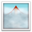 | `:foggy:`
 | `:cyclone:`

### Objects

Emoji | Aliases
----- | -------
 | `:black_nib:`
 | `:pencil2:`
 | `:email:`, `:envelope:`
 | `:scissors:`
 | `:chains:`
 | `:broken_chain:`
 | `:helmet_with_white_cross:`
 | `:pick:`
 | `:funeral_urn:`
 | `:coffin:`
 | `:gear:`
 | `:alembic:`
 | `:scales:`
 | `:crossed_swords:`
 | `:hammer_and_pick:`
 | `:phone:`, `:telephone:`
 | `:keyboard:`
 | `:bubbles:`
 | `:hair_pick:`
 | `:folding_hand_fan:`
 | `:hamsa:`
 | `:low_battery:`
 | `:identification_card:`
 | `:placard:`
 | `:headstone:`
 | `:toothbrush:`
 | `:mouse_trap:`
 | `:bucket:`
 | `:plunger:`
 | `:window:`
 | `:mirror:`
 | `:hook:`
 | `:ladder:`
 | `:screwdriver:`
 | `:carpentry_saw:`
 | `:coin:`
 | `:long_drum:`
 | `:accordion:`
 | `:military_helmet:`
 | `:banjo:`
 | `:diya_lamp:`
 | `:axe:`
 | `:razor:`
 | `:chair:`
 | `:flute:`
 | `:maracas:`
 | `:boomerang:`
 | `:crutch:`
 | `:x-ray:`
 | `:stethoscope:`
 | `:adhesive_bandage:`
 | `:drop_of_blood:`
 | `:thong_sandal:`
 | `:shorts:`
 | `:briefs:`
 | `:one-piece_swimsuit:`
 | `:ballet_shoes:`
 | `:nazar_amulet:`
 | `:receipt:`
 | `:sponge:`
 | `:soap:`
 | `:roll_of_paper:`
 | `:basket:`
 | `:broom:`
 | `:safety_pin:`
 | `:lotion_bottle:`
 | `:magnet:`
 | `:toolbox:`
 | `:fire_extinguisher:`
 | `:abacus:`
 | `:dna:`
 | `:petri_dish:`
 | `:test_tube:`
 | `:socks:`
 | `:coat:`
 | `:gloves:`
 | `:scarf:`
 | `:billed_cap:`
 | `:safety_vest:`
 | `:probing_cane:`
 | `:womans_flat_shoe:`
 | `:hiking_boot:`
 | `:goggles:`
 | `:lab_coat:`
 | `:sari:`
 | `:drum_with_drumsticks:`
 | `:shield:`
 | `:hammer_and_wrench:`
 | `:elevator:`
 | `:shopping_trolley:`
 | `:bed:`
 | `:shopping_bags:`
 | `:couch_and_lamp:`
 | `:bathtub:`
 | `:shower:`
 | `:toilet:`
 | `:smoking:`
 | `:door:`
 | `:moyai:`
 | `:ballot_box_with_ballot:`
 | `:dagger_knife:`
 | `:rolled_up_newspaper:`
 | `:old_key:`
 | `:compression:`
 | `:spiral_calendar_pad:`
 | `:spiral_note_pad:`
 | `:wastebasket:`
 | `:file_cabinet:`
 | `:card_file_box:`
 | `:card_index_dividers:`
 | `:trackball:`
 | `:three_button_mouse:`
 | `:printer:`
 | `:desktop_computer:`
 | `:lower_left_crayon:`
 | `:lower_left_paintbrush:`
 | `:lower_left_fountain_pen:`
 | `:lower_left_ballpoint_pen:`
 | `:linked_paperclips:`
 | `:dark_sunglasses:`
 | `:candle:`
 | `:telescope:`
 | `:microscope:`
 | `:nut_and_bolt:`
 | `:hammer:`
 | `:wrench:`
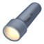 | `:flashlight:`
 | `:link:`
 | `:bookmark:`
 | `:no_bell:`
 | `:bell:`
 | `:unlock:`
 | `:lock:`
 | `:key:`
 | `:closed_lock_with_key:`
 | `:lock_with_ink_pen:`
 | `:mag_right:`
 | `:mag:`
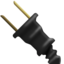 | `:electric_plug:`
 | `:battery:`
 | `:loud_sound:`
 | `:sound:`
 | `:speaker:`
 | `:mute:`
 | `:prayer_beads:`
 | `:film_projector:`
 | `:vhs:`
 | `:radio:`
 | `:tv:`
 | `:video_camera:`
 | `:camera_with_flash:`
 | `:camera:`
 | `:calling:`
 | `:iphone:`
 | `:newspaper:`
 | `:postal_horn:`
 | `:postbox:`
 | `:mailbox_with_no_mail:`
 | `:mailbox_with_mail:`
 | `:mailbox:`
 | `:mailbox_closed:`
 | `:envelope_with_arrow:`
 | `:incoming_envelope:`
 | `:e-mail:`
 | `:package:`
 | `:inbox_tray:`
 | `:outbox_tray:`
 | `:mega:`
 | `:loudspeaker:`
 | `:satellite_antenna:`
 | `:fax:`
 | `:pager:`
 | `:telephone_receiver:`
 | `:memo:`, `:pencil:`
 | `:scroll:`
 | `:books:`
 | `:orange_book:`
 | `:blue_book:`
 | `:green_book:`
 | `:book:`, `:open_book:`
 | `:closed_book:`
 | `:notebook_with_decorative_cover:`
 | `:notebook:`
 | `:ledger:`
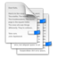 | `:bookmark_tabs:`
 | `:triangular_ruler:`
 | `:straight_ruler:`
 | `:paperclip:`
 | `:round_pushpin:`
 | `:pushpin:`
 | `:clipboard:`
 | `:bar_chart:`
 | `:chart_with_downwards_trend:`
 | `:chart_with_upwards_trend:`
 | `:card_index:`
 | `:calendar:`
 | `:date:`
 | `:page_facing_up:`
 | `:page_with_curl:`
 | `:open_file_folder:`
 | `:file_folder:`
 | `:dvd:`
 | `:cd:`
 | `:floppy_disk:`
 | `:minidisc:`
 | `:briefcase:`
 | `:computer:`
 | `:chart:`
 | `:money_with_wings:`
 | `:pound:`
 | `:euro:`
 | `:dollar:`
 | `:yen:`
 | `:credit_card:`
 | `:moneybag:`
 | `:bomb:`
 | `:bulb:`
 | `:gem:`
 | `:ring:`
 | `:pill:`
 | `:syringe:`
 | `:lipstick:`
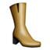 | `:boot:`
 | `:sandal:`
 | `:high_heel:`
 | `:athletic_shoe:`
 | `:mans_shoe:`, `:shoe:`
 | `:pouch:`
 | `:handbag:`
 | `:purse:`
 | `:womans_clothes:`
 | `:bikini:`
 | `:kimono:`
 | `:dress:`
 | `:jeans:`
 | `:shirt:`, `:tshirt:`
 | `:necktie:`
 | `:eyeglasses:`
 | `:womans_hat:`
 | `:crown:`
 | `:bow_and_arrow:`
 | `:label:`
 | `:izakaya_lantern:`, `:lantern:`
 | `:musical_score:`
 | `:violin:`
 | `:trumpet:`
 | `:musical_keyboard:`
 | `:guitar:`
 | `:saxophone:`
 | `:notes:`
 | `:musical_note:`
 | `:clapper:`
 | `:tophat:`
 | `:headphones:`
 | `:movie_camera:`
 | `:microphone:`
 | `:film_frames:`
 | `:control_knobs:`
 | `:level_slider:`
 | `:studio_microphone:`
 | `:mortar_board:`
 | `:school_satchel:`

### Symbols

Emoji | Aliases
----- | -------
 | `:secret:`
 | `:congratulations:`
 | `:part_alternation_mark:`
 | `:wavy_dash:`
 | `:o:`
 | `:white_large_square:`
 | `:black_large_square:`
 | `:arrow_down:`
 | `:arrow_up:`
 | `:arrow_left:`
 | `:arrow_heading_down:`
 | `:arrow_heading_up:`
 | `:loop:`
 | `:curly_loop:`
 | `:arrow_right:`
 | `:heavy_division_sign:`
 | `:heavy_minus_sign:`
 | `:heavy_plus_sign:`
 | `:exclamation:`, `:heavy_exclamation_mark:`
 | `:grey_exclamation:`
 | `:grey_question:`
 | `:question:`
 | `:negative_squared_cross_mark:`
 | `:x:`
 | `:sparkle:`
 | `:eight_pointed_black_star:`
 | `:eight_spoked_asterisk:`
 | `:star_of_david:`
 | `:latin_cross:`
 | `:heavy_multiplication_x:`
 | `:heavy_check_mark:`
 | `:white_check_mark:`
 | `:no_entry:`
 | `:ophiuchus:`
 | `:black_circle:`
 | `:white_circle:`
 | `:transgender_symbol:`
 | `:warning:`
 | `:fleur_de_lis:`
 | `:atom_symbol:`
 | `:wheelchair:`
 | `:infinity:`
 | `:recycle:`
 | `:pisces:`
 | `:aquarius:`
 | `:capricorn:`
 | `:sagittarius:`
 | `:scorpius:`
 | `:libra:`
 | `:virgo:`
 | `:leo:`
 | `:cancer:`
 | `:gemini:`
 | `:taurus:`
 | `:aries:`
 | `:wheel_of_dharma:`
 | `:yin_yang:`
 | `:peace_symbol:`
 | `:star_and_crescent:`
 | `:orthodox_cross:`
 | `:biohazard_sign:`
 | `:radioactive_sign:`
 | `:ballot_box_with_check:`
 | `:black_medium_small_square:`
 | `:white_medium_small_square:`
 | `:black_medium_square:`
 | `:white_medium_square:`
 | `:arrow_backward:`
 | `:arrow_forward:`
 | `:white_small_square:`
 | `:black_small_square:`
 | `:m:`
 | `:black_circle_for_record:`
 | `:black_square_for_stop:`
 | `:double_vertical_bar:`
 | `:black_right_pointing_triangle_with_double_vertical_bar:`
 | `:black_left_pointing_double_triangle_with_vertical_bar:`
 | `:black_right_pointing_double_triangle_with_vertical_bar:`
 | `:arrow_double_down:`
 | `:arrow_double_up:`
 | `:rewind:`
 | `:fast_forward:`
 | `:eject:`
 | `:arrow_right_hook:`
 | `:leftwards_arrow_with_hook:`
 | `:arrow_lower_left:`
 | `:arrow_lower_right:`
 | `:arrow_upper_right:`
 | `:arrow_upper_left:`
 | `:arrow_up_down:`
 | `:left_right_arrow:`
 | `:information_source:`
 | `:tm:`
 | `:interrobang:`
 | `:bangbang:`
 | `:khanda:`
 | `:heavy_equals_sign:`
 | `:large_brown_square:`
 | `:large_purple_square:`
 | `:large_green_square:`
 | `:large_yellow_square:`
 | `:large_orange_square:`
 | `:large_blue_square:`
 | `:large_red_square:`
 | `:large_brown_circle:`
 | `:large_purple_circle:`
 | `:large_green_circle:`
 | `:large_yellow_circle:`
 | `:large_orange_circle:`
 | `:wireless:`
 | `:place_of_worship:`
 | `:left_luggage:`
 | `:baggage_claim:`
 | `:customs:`
 | `:passport_control:`
 | `:wc:`
 | `:baby_symbol:`
 | `:restroom:`
 | `:womens:`
 | `:mens:`
 | `:children_crossing:`
 | `:no_pedestrians:`
 | `:no_bicycles:`
 | `:non-potable_water:`
 | `:potable_water:`
 | `:do_not_litter:`
 | `:put_litter_in_its_place:`
 | `:no_smoking:`
 | `:no_entry_sign:`
 | `:menorah_with_nine_branches:`
 | `:om_symbol:`
 | `:arrow_down_small:`
 | `:arrow_up_small:`
 | `:small_red_triangle_down:`
 | `:small_red_triangle:`
 | `:small_blue_diamond:`
 | `:small_orange_diamond:`
 | `:large_blue_diamond:`
 | `:large_orange_diamond:`
 | `:large_blue_circle:`
 | `:red_circle:`
 | `:white_square_button:`
 | `:black_square_button:`
 | `:trident:`
 | `:beginner:`
 | `:six_pointed_star:`
 | `:abc:`
 | `:symbols:`
 | `:1234:`
 | `:abcd:`
 | `:capital_abcd:`
 | `:keycap_ten:`
 | `:underage:`
 | `:top:`
 | `:soon:`
 | `:on:`
 | `:end:`
 | `:back:`
 | `:radio_button:`
 | `:high_brightness:`
 | `:low_brightness:`
 | `:arrows_counterclockwise:`
 | `:arrows_clockwise:`
 | `:repeat_one:`
 | `:repeat:`
 | `:twisted_rightwards_arrows:`
 | `:signal_strength:`
 | `:no_mobile_phones:`
 | `:mobile_phone_off:`
 | `:vibration_mode:`
 | `:name_badge:`
 | `:heavy_dollar_sign:`
 | `:currency_exchange:`
 | `:diamond_shape_with_a_dot_inside:`
 | `:atm:`
 | `:cinema:`
 | `:accept:`
 | `:ideograph_advantage:`
 | `:u55b6:`
 | `:u5272:`
 | `:u7533:`
 | `:u6708:`
 | `:u6709:`
 | `:u6e80:`
 | `:u5408:`
 | `:u7a7a:`
 | `:u7981:`
 | `:u6307:`
 | `:u7121:`
 | `:sa:`
 | `:koko:`
 | `:vs:`
 | `:up:`
 | `:sos:`
 | `:ok:`
 | `:ng:`
 | `:new:`
 | `:id:`
 | `:free:`
 | `:cool:`
 | `:cl:`
 | `:ab:`
 | `:parking:`
 | `:o2:`
 | `:b:`
 | `:a:`
 | `:registered:`
 | `:copyright:`
 | `:nine:`
 | `:eight:`
 | `:seven:`
 | `:six:`
 | `:five:`
 | `:four:`
 | `:three:`
 | `:two:`
 | `:one:`
 | `:zero:`
 | `:keycap_star:`
 | `:hash:`

### Flags

Emoji | Aliases
----- | -------
 | `:triangular_flag_on_post:`
 | `:waving_black_flag:`
 | `:flag-wales:`
 | `:flag-scotland:`
 | `:flag-england:`
 | `:pirate_flag:`
 | `:waving_white_flag:`
 | `:transgender_flag:`
 | `:rainbow-flag:`
 | `:checkered_flag:`
 | `:crossed_flags:`
 | `:flag-zw:`
 | `:flag-zm:`
 | `:flag-za:`
 | `:flag-yt:`
 | `:flag-ye:`
 | `:flag-xk:`
 | `:flag-ws:`
 | `:flag-wf:`
 | `:flag-vu:`
 | `:flag-vn:`
 | `:flag-vi:`
 | `:flag-vg:`
 | `:flag-ve:`
 | `:flag-vc:`
 | `:flag-va:`
 | `:flag-uz:`
 | `:flag-uy:`
 | `:us:`, `:flag-us:`
 | `:flag-un:`
 | `:flag-um:`
 | `:flag-ug:`
 | `:flag-ua:`
 | `:flag-tz:`
 | `:flag-tw:`
 | `:flag-tv:`
 | `:flag-tt:`
 | `:flag-tr:`
 | `:flag-to:`
 | `:flag-tn:`
 | `:flag-tm:`
 | `:flag-tl:`
 | `:flag-tk:`
 | `:flag-tj:`
 | `:flag-th:`
 | `:flag-tg:`
 | `:flag-tf:`
 | `:flag-td:`
 | `:flag-tc:`
 | `:flag-ta:`
 | `:flag-sz:`
 | `:flag-sy:`
 | `:flag-sx:`
 | `:flag-sv:`
 | `:flag-st:`
 | `:flag-ss:`
 | `:flag-sr:`
 | `:flag-so:`
 | `:flag-sn:`
 | `:flag-sm:`
 | `:flag-sl:`
 | `:flag-sk:`
 | `:flag-sj:`
 | `:flag-si:`
 | `:flag-sh:`
 | `:flag-sg:`
 | `:flag-se:`
 | `:flag-sd:`
 | `:flag-sc:`
 | `:flag-sb:`
 | `:flag-sa:`
 | `:flag-rw:`
 | `:ru:`, `:flag-ru:`
 | `:flag-rs:`
 | `:flag-ro:`
 | `:flag-re:`
 | `:flag-qa:`
 | `:flag-py:`
 | `:flag-pw:`
 | `:flag-pt:`
 | `:flag-ps:`
 | `:flag-pr:`
 | `:flag-pn:`
 | `:flag-pm:`
 | `:flag-pl:`
 | `:flag-pk:`
 | `:flag-ph:`
 | `:flag-pg:`
 | `:flag-pf:`
 | `:flag-pe:`
 | `:flag-pa:`
 | `:flag-om:`
 | `:flag-nz:`
 | `:flag-nu:`
 | `:flag-nr:`
 | `:flag-np:`
 | `:flag-no:`
 | `:flag-nl:`
 | `:flag-ni:`
 | `:flag-ng:`
 | `:flag-nf:`
 | `:flag-ne:`
 | `:flag-nc:`
 | `:flag-na:`
 | `:flag-mz:`
 | `:flag-my:`
 | `:flag-mx:`
 | `:flag-mw:`
 | `:flag-mv:`
 | `:flag-mu:`
 | `:flag-mt:`
 | `:flag-ms:`
 | `:flag-mr:`
 | `:flag-mq:`
 | `:flag-mp:`
 | `:flag-mo:`
 | `:flag-mn:`
 | `:flag-mm:`
 | `:flag-ml:`
 | `:flag-mk:`
 | `:flag-mh:`
 | `:flag-mg:`
 | `:flag-mf:`
 | `:flag-me:`
 | `:flag-md:`
 | `:flag-mc:`
 | `:flag-ma:`
 | `:flag-ly:`
 | `:flag-lv:`
 | `:flag-lu:`
 | `:flag-lt:`
 | `:flag-ls:`
 | `:flag-lr:`
 | `:flag-lk:`
 | `:flag-li:`
 | `:flag-lc:`
 | `:flag-lb:`
 | `:flag-la:`
 | `:flag-kz:`
 | `:flag-ky:`
 | `:flag-kw:`
 | `:kr:`, `:flag-kr:`
 | `:flag-kp:`
 | `:flag-kn:`
 | `:flag-km:`
 | `:flag-ki:`
 | `:flag-kh:`
 | `:flag-kg:`
 | `:flag-ke:`
 | `:jp:`, `:flag-jp:`
 | `:flag-jo:`
 | `:flag-jm:`
 | `:flag-je:`
 | `:it:`, `:flag-it:`
 | `:flag-is:`
 | `:flag-ir:`
 | `:flag-iq:`
 | `:flag-io:`
 | `:flag-in:`
 | `:flag-im:`
 | `:flag-il:`
 | `:flag-ie:`
 | `:flag-id:`
 | `:flag-ic:`
 | `:flag-hu:`
 | `:flag-ht:`
 | `:flag-hr:`
 | `:flag-hn:`
 | `:flag-hm:`
 | `:flag-hk:`
 | `:flag-gy:`
 | `:flag-gw:`
 | `:flag-gu:`
 | `:flag-gt:`
 | `:flag-gs:`
 | `:flag-gr:`
 | `:flag-gq:`
 | `:flag-gp:`
 | `:flag-gn:`
 | `:flag-gm:`
 | `:flag-gl:`
 | `:flag-gi:`
 | `:flag-gh:`
 | `:flag-gg:`
 | `:flag-gf:`
 | `:flag-ge:`
 | `:flag-gd:`
 | `:gb:`, `:uk:`, `:flag-gb:`, `:flag-uk:`
 | `:flag-ga:`
 | `:fr:`, `:flag-fr:`
 | `:flag-fo:`
 | `:flag-fm:`
 | `:flag-fk:`
 | `:flag-fj:`
 | `:flag-fi:`
 | `:flag-eu:`
 | `:flag-et:`
 | `:es:`, `:flag-es:`
 | `:flag-er:`
 | `:flag-eh:`
 | `:flag-eg:`
 | `:flag-ee:`
 | `:flag-ec:`
 | `:flag-ea:`
 | `:flag-dz:`
 | `:flag-do:`
 | `:flag-dm:`
 | `:flag-dk:`
 | `:flag-dj:`
 | `:flag-dg:`
 | `:de:`, `:flag-de:`
 | `:flag-cz:`
 | `:flag-cy:`
 | `:flag-cx:`
 | `:flag-cw:`
 | `:flag-cv:`
 | `:flag-cu:`
 | `:flag-cr:`
 | `:flag-cp:`
 | `:flag-co:`
 | `:cn:`, `:flag-cn:`
 | `:flag-cm:`
 | `:flag-cl:`
 | `:flag-ck:`
 | `:flag-ci:`
 | `:flag-ch:`
 | `:flag-cg:`
 | `:flag-cf:`
 | `:flag-cd:`
 | `:flag-cc:`
 | `:flag-ca:`
 | `:flag-bz:`
 | `:flag-by:`
 | `:flag-bw:`
 | `:flag-bv:`
 | `:flag-bt:`
 | `:flag-bs:`
 | `:flag-br:`
 | `:flag-bq:`
 | `:flag-bo:`
 | `:flag-bn:`
 | `:flag-bm:`
 | `:flag-bl:`
 | `:flag-bj:`
 | `:flag-bi:`
 | `:flag-bh:`
 | `:flag-bg:`
 | `:flag-bf:`
 | `:flag-be:`
 | `:flag-bd:`
 | `:flag-bb:`
 | `:flag-ba:`
 | `:flag-az:`
 | `:flag-ax:`
 | `:flag-aw:`
 | `:flag-au:`
 | `:flag-at:`
 | `:flag-as:`
 | `:flag-ar:`
 | `:flag-aq:`
 | `:flag-ao:`
 | `:flag-am:`
 | `:flag-al:`
 | `:flag-ai:`
 | `:flag-ag:`
 | `:flag-af:`
 | `:flag-ae:`
 | `:flag-ad:`
 | `:flag-ac:`

## License

Each logo is owned by their respective creators.
