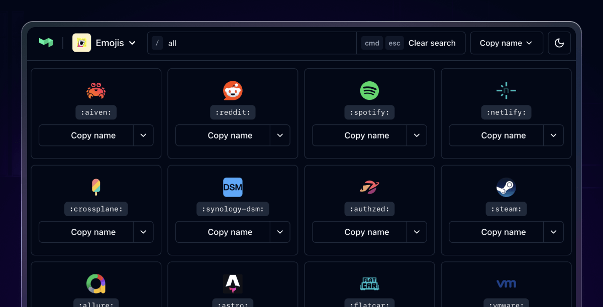

# Buildkite Emojis

Custom emojis supported by [Buildkite](https://buildkite.com/) that you can use in your Buildkite pipelines, including the terminal output of builds, as well as in test suites and registries.

To use an emoji, write the name of the emoji in between colons, like :buildkite: which shows up as 

## Contributing a new emoji

Missing your favorite tool or want to better represent a Buildkite feature? Contribute your own custom emoji by following these simple steps:

1. Prepare a `64x64` PNG image following the [image guidelines](#image-guidelines) below
1. Fork this repo
1. Add the image to the `img-buildkite-64` directory
1. Add it to the top of the `img-buildkite-64.json` file
1. Send a pull request

If we're missing Unicode emoji, follow the instructions in [docs/updating-unicode.md](docs/updating-unicode.md)

## Image guidelines

Buildkite emoji will be shown on both light or dark backgrounds, and at a small size. Try to follow the guidelines below to make sure your emoji looks the best it can ✨

## Emoji Reference

Explore the full list of Buildkite-specific emojis at [emoji.buildkite.com ↗](https://emoji.buildkite.com/)

## License

Each logo is owned by their respective creators.
