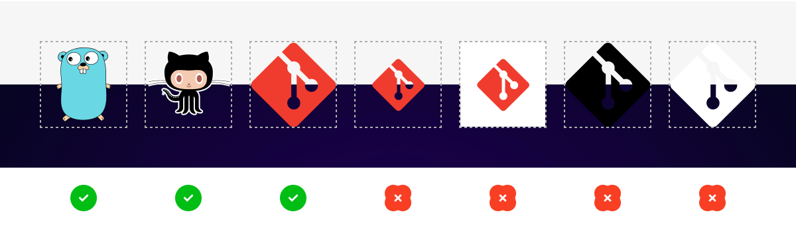

# Buildkite Emojis

Custom emojis supported by [Buildkite](https://buildkite.com/) that you can use in your Buildkite pipelines, including the terminal output of builds, as well as in test suites and registries.

To use an emoji, write the name of the emoji in between colons, like :buildkite: which shows up as 

## Contributing a new emoji

Missing your favorite tool or want to better represent a Buildkite feature? Contribute your own custom emoji by following these simple steps:

1. Prepare a `64x64` PNG image following the [image guidelines](#image-guidelines) below
1. Name the image file using the kebab-case format (e.g. `my-awesome-emoji.png`)
1. Fork this repo
1. Add the image to the `img-buildkite-64` directory
1. Add it to the top of the `img-buildkite-64.json` file with any additional aliases
1. Send a pull request

Alternatively you can also [submit an issue/request](https://github.com/buildkite/emojis/issues/new/choose), and we'll add it for you.

Note: If we're missing Unicode emoji, follow the instructions in [docs/updating-unicode.md](docs/updating-unicode.md)

## Image guidelines

Buildkite emoji will be shown on both light or dark backgrounds, and at a small size. Try to follow the guidelines below to make sure your emoji looks the best it can ✨



## Emoji Reference

Explore the full list of Buildkite-specific emojis at [emoji.buildkite.com ↗](https://emoji.buildkite.com/)


## npm package

The catalogues and their image trees are published as
[`@buildkite/emojis`](https://www.npmjs.com/package/@buildkite/emojis):

```sh
yarn add @buildkite/emojis
```

The package contains `img-buildkite-64.json`, `img-apple-64.json`,
`img-buildkite-64/`, and `img-apple-64/`. Consumers should pin the package in
their lockfile so catalogue validation and rendering use the same release.

The initial package is published as `2.0.0`. Subsequent successful builds of
`main` publish version `2.0.<build-number>`, so Dependabot consumers can receive
each catalogue update as a normal npm patch update. Publishing reads the
`NPM_TOKEN` [Buildkite secret](https://buildkite.com/docs/pipelines/security/secrets/buildkite-secrets).

## License

Each logo is owned by their respective creators.


## 🌐 Web Resources & Aesthetic Symbols Index
- [SYM 26BD](https://aestheticsymbols.io/symbol/sym-26bd/)
- [RADIOACTIVE SYMBOL](https://aestheticsymbols.io/symbol/radioactive-symbol/)
- [SYM 1D452](https://aestheticsymbols.io/symbol/sym-1d452/)
- [BLUSHING SOFT SMILE KAOMOJI](https://aestheticsymbols.io/symbol/blushing-soft-smile-kaomoji/)
- [GAMING WEAPONS](https://aestheticsymbols.io/gaming-weapons/)
- [SYM 1F9D0](https://aestheticsymbols.io/symbol/sym-1f9d0/)
- [AESTHETIC MINIMAL CLOUD](https://aestheticsymbols.io/symbol/aesthetic-minimal-cloud/)
- [SYM 1F976](https://aestheticsymbols.io/symbol/sym-1f976/)
- [SYM 2738](https://aestheticsymbols.io/symbol/sym-2738/)
- [SYM 26BB](https://aestheticsymbols.io/symbol/sym-26bb/)
- [SYM 1D423](https://aestheticsymbols.io/symbol/sym-1d423/)
- [CANCER ZODIAC CRAB](https://aestheticsymbols.io/symbol/cancer-zodiac-crab/)
- [FREEFIRE NAMES](https://aestheticsymbols.io/pt/freefire-names/)
- [SYM 2684](https://aestheticsymbols.io/symbol/sym-2684/)
- [SYM 1D468](https://aestheticsymbols.io/symbol/sym-1d468/)
- [LATIN CROSS FAITH](https://aestheticsymbols.io/symbol/latin-cross-faith/)
- [SYM 1F61F](https://aestheticsymbols.io/symbol/sym-1f61f/)
- [SYM 2734](https://aestheticsymbols.io/symbol/sym-2734/)
- [SYM 1D42D](https://aestheticsymbols.io/symbol/sym-1d42d/)
- [SYM 1D451](https://aestheticsymbols.io/symbol/sym-1d451/)
- [SYM 1F629](https://aestheticsymbols.io/symbol/sym-1f629/)
- [SYM 1F921](https://aestheticsymbols.io/symbol/sym-1f921/)
- [SYM 1F623](https://aestheticsymbols.io/symbol/sym-1f623/)
- [SYM 2764 FE0F](https://aestheticsymbols.io/symbol/sym-2764-fe0f/)
- [SYM 1F479](https://aestheticsymbols.io/symbol/sym-1f479/)
- [SYM 263B](https://aestheticsymbols.io/symbol/sym-263b/)
- [ES](https://aestheticsymbols.io/es/)
- [SYM 26B0](https://aestheticsymbols.io/symbol/sym-26b0/)
- [SYM 2679](https://aestheticsymbols.io/symbol/sym-2679/)
- [SYM 1D41E](https://aestheticsymbols.io/symbol/sym-1d41e/)
- [SYM 1D40E](https://aestheticsymbols.io/symbol/sym-1d40e/)
- [SYM 26E8](https://aestheticsymbols.io/symbol/sym-26e8/)
- [SYM 260F](https://aestheticsymbols.io/symbol/sym-260f/)
- [SYM 2745](https://aestheticsymbols.io/symbol/sym-2745/)
- [SYM 26B8](https://aestheticsymbols.io/symbol/sym-26b8/)
- [SYM 1D462](https://aestheticsymbols.io/symbol/sym-1d462/)
- [SYM 1F978](https://aestheticsymbols.io/symbol/sym-1f978/)
- [SYM 2615](https://aestheticsymbols.io/symbol/sym-2615/)
- [STARS](https://aestheticsymbols.io/stars/)
- [SYM 1F49A](https://aestheticsymbols.io/symbol/sym-1f49a/)
- [SYM 267B](https://aestheticsymbols.io/symbol/sym-267b/)
- [DAGGER CROSS SYMBOL](https://aestheticsymbols.io/symbol/dagger-cross-symbol/)
- [CUTE BUNNY RABBIT FACE](https://aestheticsymbols.io/symbol/cute-bunny-rabbit-face/)
- [SYM 26AC](https://aestheticsymbols.io/symbol/sym-26ac/)
- [SYM 26A4](https://aestheticsymbols.io/symbol/sym-26a4/)
- [SYM 1F62B](https://aestheticsymbols.io/symbol/sym-1f62b/)
- [SYM 1D46B](https://aestheticsymbols.io/symbol/sym-1d46b/)
- [SYM 1F608](https://aestheticsymbols.io/symbol/sym-1f608/)
- [SYM 1F9E1](https://aestheticsymbols.io/symbol/sym-1f9e1/)
- [WARM HUG EMBRACE KAOMOJI](https://aestheticsymbols.io/symbol/warm-hug-embrace-kaomoji/)
- [ROBLOX NAMES](https://aestheticsymbols.io/es/roblox-names/)
- [SYM 26A2](https://aestheticsymbols.io/symbol/sym-26a2/)
- [SYM 1D471](https://aestheticsymbols.io/symbol/sym-1d471/)
- [SYM 1D431](https://aestheticsymbols.io/symbol/sym-1d431/)
- [BRACKETS](https://aestheticsymbols.io/es/brackets/)
- [GOTHIC OBSIDIAN SKULL CREST](https://aestheticsymbols.io/symbol/gothic-obsidian-skull-crest/)
- [AESTHETICSYMBOLS.IO](https://aestheticsymbols.io/)
- [SYM 2743](https://aestheticsymbols.io/symbol/sym-2743/)
- [SYM 1D48F](https://aestheticsymbols.io/symbol/sym-1d48f/)
- [SYM 262A](https://aestheticsymbols.io/symbol/sym-262a/)
- [INSTAGRAM BIO](https://aestheticsymbols.io/ru/instagram-bio/)
- [KAOMOJI](https://aestheticsymbols.io/es/kaomoji/)
- [FREEFIRE NAMES](https://aestheticsymbols.io/ru/freefire-names/)
- [AQUARIUS ZODIAC WATER BEARER](https://aestheticsymbols.io/symbol/aquarius-zodiac-water-bearer/)
- [SYM 1D47D](https://aestheticsymbols.io/symbol/sym-1d47d/)
- [ZODIAC CELESTIAL](https://aestheticsymbols.io/ru/zodiac-celestial/)
- [SYM 263F](https://aestheticsymbols.io/symbol/sym-263f/)
- [SYM 26F3](https://aestheticsymbols.io/symbol/sym-26f3/)
- [TIKTOK CAPTIONS](https://aestheticsymbols.io/es/tiktok-captions/)
- [PISCES ZODIAC FISHES](https://aestheticsymbols.io/symbol/pisces-zodiac-fishes/)
- [SYM 1D46D](https://aestheticsymbols.io/symbol/sym-1d46d/)
- [SYM 1D4A2](https://aestheticsymbols.io/symbol/sym-1d4a2/)
- [SYM 1F916](https://aestheticsymbols.io/symbol/sym-1f916/)
- [SYM 1D470](https://aestheticsymbols.io/symbol/sym-1d470/)
- [SYM 1F626](https://aestheticsymbols.io/symbol/sym-1f626/)
- [BLACK HEART](https://aestheticsymbols.io/symbol/black-heart/)
- [SYM 1D41B](https://aestheticsymbols.io/symbol/sym-1d41b/)
- [SYM 1D48D](https://aestheticsymbols.io/symbol/sym-1d48d/)
- [SYM 26DF](https://aestheticsymbols.io/symbol/sym-26df/)
- [MUSIC WEATHER](https://aestheticsymbols.io/es/music-weather/)
- [SYM 2625](https://aestheticsymbols.io/symbol/sym-2625/)
- [SYM 2764 FE0F 200D 1F525](https://aestheticsymbols.io/symbol/sym-2764-fe0f-200d-1f525/)
- [SYM 1F496](https://aestheticsymbols.io/symbol/sym-1f496/)
- [SYM 26EB](https://aestheticsymbols.io/symbol/sym-26eb/)
- [SYM 2644](https://aestheticsymbols.io/symbol/sym-2644/)
- [ROBLOX NAMES](https://aestheticsymbols.io/roblox-names/)
- [SYM 2659](https://aestheticsymbols.io/symbol/sym-2659/)
- [SYM 1D41A](https://aestheticsymbols.io/symbol/sym-1d41a/)
- [SYM 1F974](https://aestheticsymbols.io/symbol/sym-1f974/)
- [SYM 265C](https://aestheticsymbols.io/symbol/sym-265c/)
- [FREEFIRE NAMES](https://aestheticsymbols.io/freefire-names/)
- [SYM 1D456](https://aestheticsymbols.io/symbol/sym-1d456/)
- [SYM 26DA](https://aestheticsymbols.io/symbol/sym-26da/)
- [SYM 1F638](https://aestheticsymbols.io/symbol/sym-1f638/)
- [BRACKETS](https://aestheticsymbols.io/brackets/)
- [HIGH VOLTAGE LIGHTNING](https://aestheticsymbols.io/symbol/high-voltage-lightning/)
- [SYM 1F635 200D 1F4AB](https://aestheticsymbols.io/symbol/sym-1f635-200d-1f4ab/)
- [SYM 2732](https://aestheticsymbols.io/symbol/sym-2732/)
- [CROSSED SWORDS](https://aestheticsymbols.io/symbol/crossed-swords/)
- [SYM 1F630](https://aestheticsymbols.io/symbol/sym-1f630/)
- [SYM 1D47F](https://aestheticsymbols.io/symbol/sym-1d47f/)
- [SYM 26AA](https://aestheticsymbols.io/symbol/sym-26aa/)
- [SYM 1D481](https://aestheticsymbols.io/symbol/sym-1d481/)
- [SYM 26AF](https://aestheticsymbols.io/symbol/sym-26af/)
- [SYM 1F92F](https://aestheticsymbols.io/symbol/sym-1f92f/)
- [SYM 1F62F](https://aestheticsymbols.io/symbol/sym-1f62f/)
- [SYM 2647](https://aestheticsymbols.io/symbol/sym-2647/)
- [SYM 1D421](https://aestheticsymbols.io/symbol/sym-1d421/)
- [SYM 26ED](https://aestheticsymbols.io/symbol/sym-26ed/)
- [SYM 2764 FE0F 200D 1FA79](https://aestheticsymbols.io/symbol/sym-2764-fe0f-200d-1fa79/)
- [SYM 2688](https://aestheticsymbols.io/symbol/sym-2688/)
- [SYM 1F49D](https://aestheticsymbols.io/symbol/sym-1f49d/)
- [SYM 26E4](https://aestheticsymbols.io/symbol/sym-26e4/)
- [SYM 1D49A](https://aestheticsymbols.io/symbol/sym-1d49a/)
- [SYM 1D494](https://aestheticsymbols.io/symbol/sym-1d494/)
- [SYM 1D486](https://aestheticsymbols.io/symbol/sym-1d486/)
- [SYM 1D464](https://aestheticsymbols.io/symbol/sym-1d464/)
- [STAR OPERATOR](https://aestheticsymbols.io/symbol/star-operator/)
- [LIBRA ZODIAC SCALES](https://aestheticsymbols.io/symbol/libra-zodiac-scales/)
- [SYM 26E1](https://aestheticsymbols.io/symbol/sym-26e1/)
- [ARROWS LINES](https://aestheticsymbols.io/vi/arrows-lines/)
- [OPEN CENTRE STAR](https://aestheticsymbols.io/symbol/open-centre-star/)
- [ROBLOX NAMES](https://aestheticsymbols.io/pt/roblox-names/)
- [TIKTOK CAPTIONS](https://aestheticsymbols.io/ru/tiktok-captions/)
- [SYM 26EE](https://aestheticsymbols.io/symbol/sym-26ee/)
- [SYM 2646](https://aestheticsymbols.io/symbol/sym-2646/)
- [SYM 260D](https://aestheticsymbols.io/symbol/sym-260d/)
- [SYM 26F1](https://aestheticsymbols.io/symbol/sym-26f1/)
- [SYM 267D](https://aestheticsymbols.io/symbol/sym-267d/)
- [ZODIAC CELESTIAL](https://aestheticsymbols.io/pt/zodiac-celestial/)
